# Developing Terminal with Fr8 production Hub

## Prerequisits 

1) Fr8 account. For the purpose of this tutorial we will use standart account registered on [https://fr8.co](https://fr8.co) site. 
2) Stable internet connection. 

We will build terminal with simple networking utilities.  

## Step 1: Create and configure new terminal project using the Visual Studio Template.
Create new project in Visual Studio.
You can type fr8 in templates searchbox and see latest terminal template from online gallery.   
 
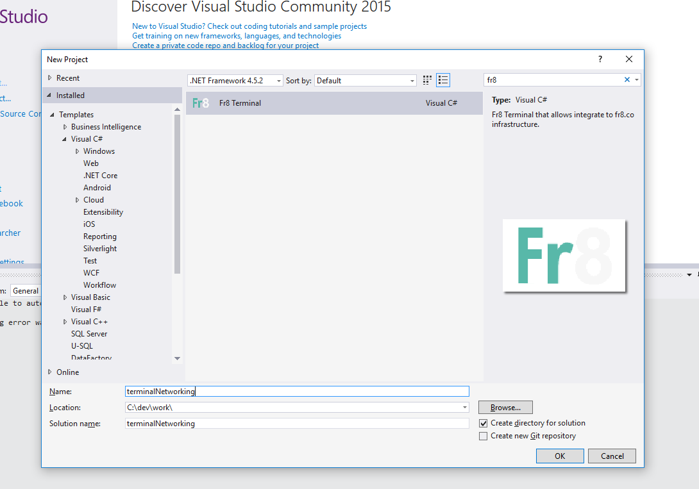 

After the project created you will see files structure like this, also try to rebuild the project to be sure that all packages have been restored and everything is good.  

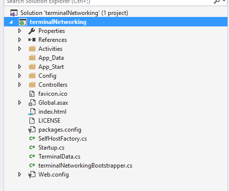

Check **Web.config** file, what we interested in - is an appSettings section:

```xml
    <appSettings file="Config/Settings.config">
        <!-- Hub settings -->
        <add key="DefaultHubUrl" value="https://fr8.co/" />
        <add key="HubApiVersion" value="v1" />
        <!-- Terminal settings -->
        <add key="terminalNetworking.TerminalEndpoint" value="http://localhost:12345" />
        <add key="HubOAuthRedirectUri" value="https://fr8.co/AuthenticationCallback/ProcessSuccessfulOAuthResponse?terminalName=terminalNetworking&amp;terminalVersion=1" />   
    </appSettings>
```

First you should noticed that for the sake of security we externalize a part of settings to separate file, you should not place it into your public repository, add it to ignore file.  
Also as we developing our terminal without local hub, we shold replace **DefaultHubUrl** with public fr8 Hub, *HubOAuthRedirectUri* parameter is not necessary if we will not be use external authentication.
**terminalNetworking.TerminalEndpoint** is url of our terminal for the hub. 

Edit **TerminalData.cs** file:

```cs
    using Fr8.Infrastructure.Data.DataTransferObjects;
    using Fr8.Infrastructure.Data.States;
    using Fr8.Infrastructure.Utilities.Configuration;

    namespace terminalNetworking
    {
        public static class TerminalData
        {
            public static ActivityCategoryDTO ActivityCategoryDTO = new ActivityCategoryDTO
            {
                Name = "Networking",
                IconPath = "http://sts.wustl.edu/wp-content/uploads/2014/05/Devices-network-wired-icon.png",
                Type = "WebService"
            };

            public static TerminalDTO TerminalDTO = new TerminalDTO
            {
                Endpoint = CloudConfigurationManager.GetSetting("terminalNetworking.TerminalEndpoint"),
                TerminalStatus = TerminalStatus.Active,
                Name = "terminalNetworking",
                Label = "Networking",
                Version = "1",
                AuthenticationType = AuthenticationType.External
            };
        }
    }
```

Add simple *Activity* by renaming *My_Activity_v1* to *Ping_v1*, in order to do this 
 - rename it in Startup.cs file in *RegisterActivities* method;
 - rename file and calss inside Activities folder; 

After this our activity should looks like this:
```cs 

using System;
using System.Collections.Generic;
using System.Threading.Tasks;
using Fr8.Infrastructure.Data.Control;
using Fr8.Infrastructure.Data.DataTransferObjects;
using Fr8.Infrastructure.Data.Managers;
using Fr8.Infrastructure.Data.Manifests;
using Fr8.TerminalBase.BaseClasses;
using Fr8.TerminalBase.Infrastructure;
using Fr8.Infrastructure.Data.Crates;

using System.Text;
using System.Net.NetworkInformation;

namespace terminalNetworking.Activities
{
    public class Ping_v1 : TerminalActivity<Ping_v1.ActivityUi>
    {
        private readonly string RunTimeCrateLabel = "Ping result";

        public static ActivityTemplateDTO ActivityTemplateDTO = new ActivityTemplateDTO
        {
            Id = new Guid("6719f5b2-a48a-4da2-b898-6f5b7b88005b"),
            Name = "Ping",
            Label = "Ping",
            Version = "1",
            MinPaneWidth = 330,
            Terminal = TerminalData.TerminalDTO,
            NeedsAuthentication = false,
            Categories = new[]
            {
                ActivityCategories.Receive,
                TerminalData.ActivityCategoryDTO
            }
        };
        protected override ActivityTemplateDTO MyTemplate => ActivityTemplateDTO;

        public class ActivityUi : StandardConfigurationControlsCM
        {
            public TextSource Address { get; set; }

            public ActivityUi()
            {
                Address = new TextSource
                {
                    InitialLabel = "Address",
                    Label = "Address",
                    Name = nameof(Address),
                    Source = new FieldSourceDTO
                    {
                        ManifestType = CrateManifestTypes.StandardDesignTimeFields,
                        RequestUpstream = true
                    }
                };
                Controls = new List<ControlDefinitionDTO> { Address };
            }
        }

        public Ping_v1(ICrateManager crateManager)
            : base(crateManager)
        {
        }

        public override Task Initialize()
        {
            CrateSignaller.MarkAvailableAtRuntime<StandardPayloadDataCM>(RunTimeCrateLabel).AddFields("Ping result");
            return Task.FromResult(0);
        }

        public override Task FollowUp()
        {
            return Task.FromResult(0);
        }

        protected override Task Validate()
        {
            // use ValidationManager extension method  
            ValidationManager.ValidateTextSourceNotEmpty(ActivityUI.Address,"Network address to ping not specified");
            return Task.FromResult(0);
        }

        public override Task Run()
        {
            // we take standard implementation from msdn article
            Ping pingSender = new Ping();
            PingOptions options = new PingOptions();

            // Use the default Ttl value which is 128,
            // but change the fragmentation behavior.
            options.DontFragment = true;

            // Create a buffer of 32 bytes of data to be transmitted.
            string data = "aaaaaaaaaaaaaaaaaaaaaaaaaaaaaaaa";
            byte[] buffer = Encoding.ASCII.GetBytes(data);
            int timeout = 120;
            PingReply reply = pingSender.Send(ActivityUI.Address.TextValue, timeout, buffer, options);

            StandardPayloadDataCM payload;

            if (reply.Status == IPStatus.Success)
            {
                payload = new StandardPayloadDataCM(new KeyValueDTO("Ping result", "true"));
            }
            else
            {
                payload = new StandardPayloadDataCM(new KeyValueDTO("Ping result", "false"));
            }

            Payload.Add(RunTimeCrateLabel, payload);

            return Task.FromResult(0);
        }
    }
}

``` 

To avoid problems with hub interraction we have to run our terminal on Local IIS instead of IIS Express (because last one returns HTTP 400 Error in case your request pointed to another hostname).
Configure site with bindings to all ip addresses:

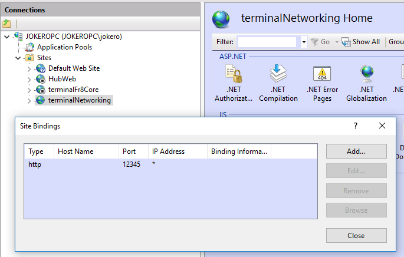

And project startup:

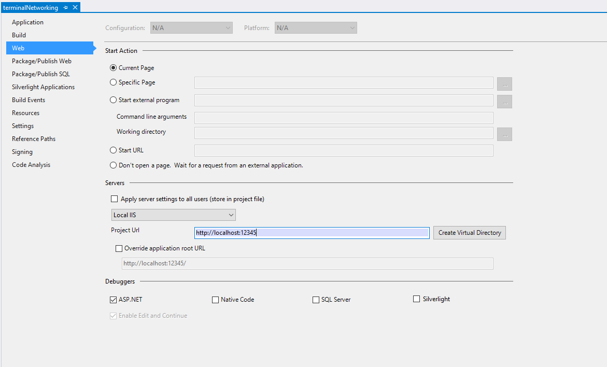

That is how it should looks like in a browser: (also ensure that other address http://127.0.0.1 work)

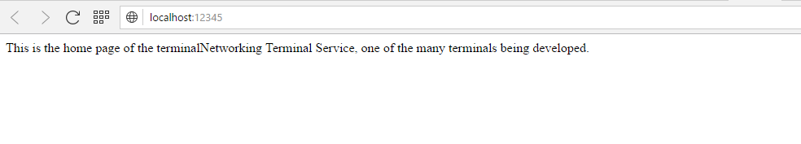

## Step 2: Establish a publicly visible URL so that the dev Hub can see your terminal.
Action on this step depends on your internet connection, in case you have publically avaliable IP address you may do nothing except allowing ports in your firewall settings and forward it from router in case you are using it.
If you don`t have static public IP address, like in case of this tutorial, we suggest you to use free utility [*ngrok*](http://ngrok.com) to be able esteblish connection with hub.
Start *ngrok* with parameters:
```cmd
    ngrok http 12345
```

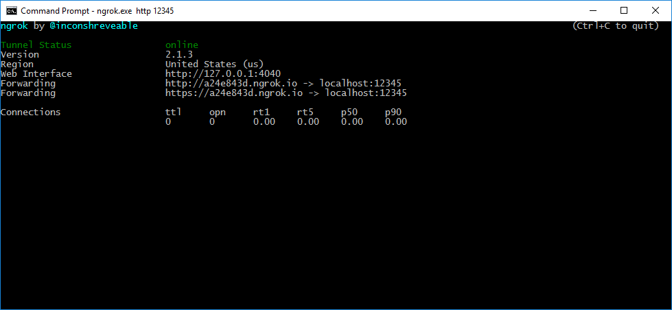

When you try access the ngrok Url you should see same respons as well as from localhost site.

## Step 3: Register terminal at the Hub.
Edit your terminal`s Web.config file, to specify ngrok endpoint as the terminal endpoint.

```xml
    <add key="terminalNetworking.TerminalEndpoint" value="http://a24e843d.ngrok.io" />   
```

Run your terminal project and ensure that IIS site is running.

Log in to [https://fr8.co](https://fr8.co) with your account and turn on 'Developers menu'

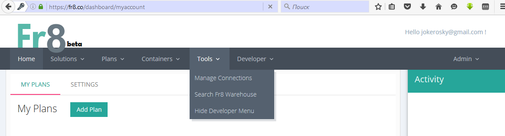

Go to 'My terminals' page and add your terminal by ngrok link:

 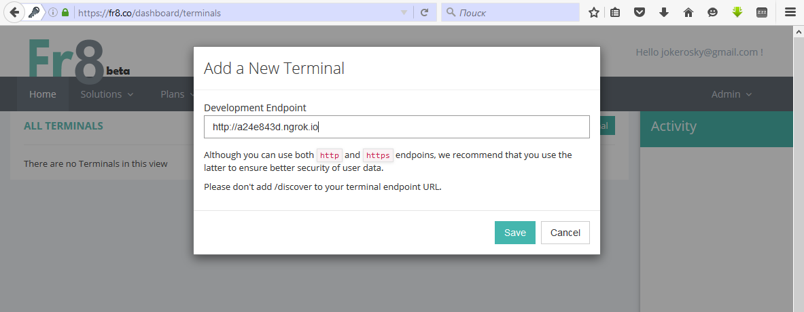

If everything goes fine, you will see your terminal in list:

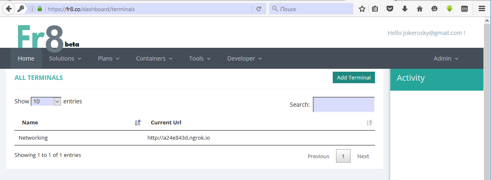

## Step 4: Build a plan using your terminal Activity.

Ok, let's create a new plan, go to PlanBuilder page, find our terminal logo and add an Activity. (if you concerned about yellow triangle in address line, use only *https* content, in our case it is link to terminal logo supplied with http) 

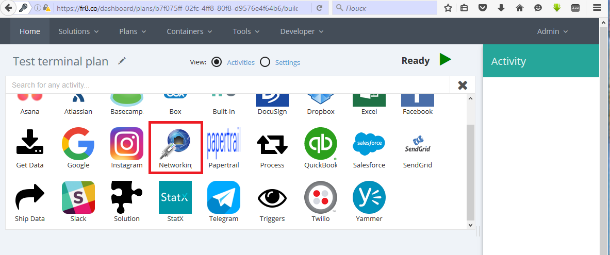

Add another one activity, 'Publish to Slack' will be fine, configure them  and try to run.

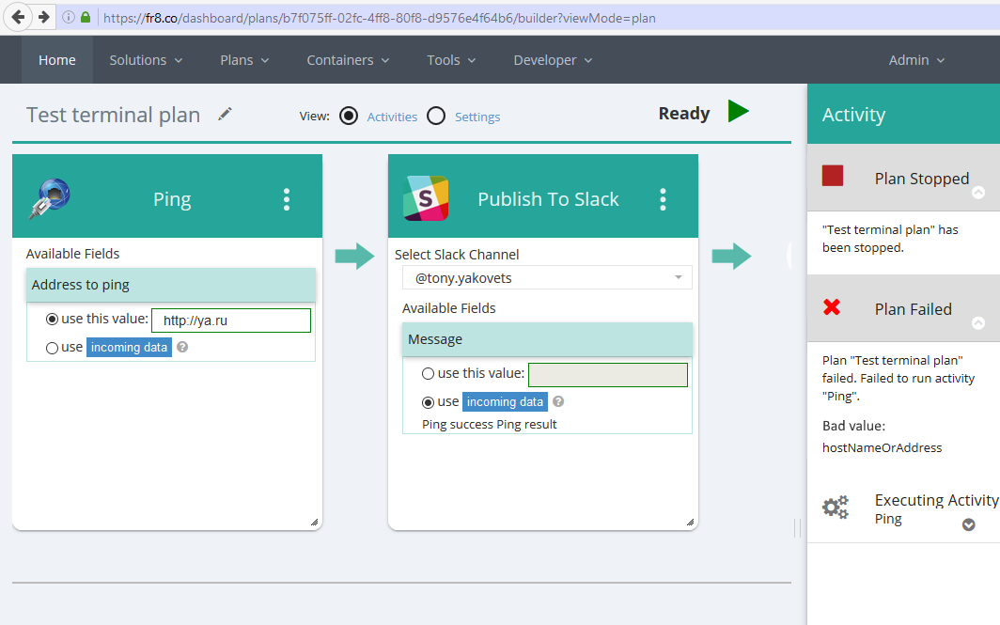

Oops! The plan is failed, so we should set breakpoint in our code to find out what is wrong:

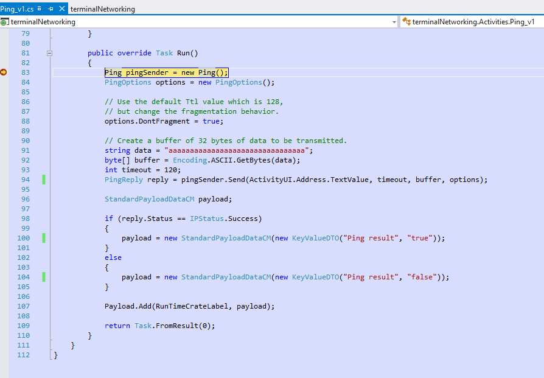

Now when we know what was wrong (dns name of the host we want to ping) fix it and run the plan again

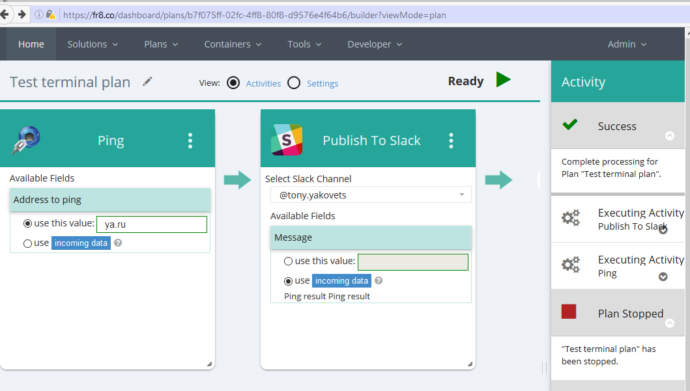

So now, when it works, we can submit form to publish our terminal.

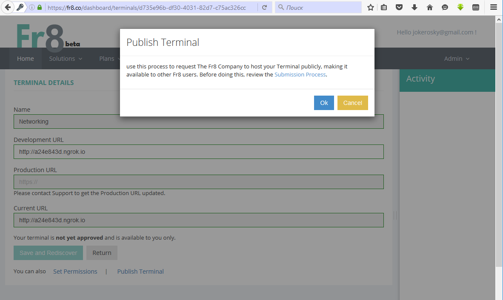 