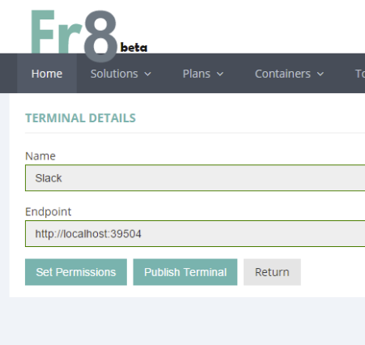

Getting your Terminal Deployed at Fr8.co
=========================================

If you've built a useful Terminal, we'd like to get it deployed and available to Fr8 users. There are two basic ways to do this:

1) You can invite The Fr8 Company to deploy it at fr8.co

2) You can deploy it yourselve and invite The Fr8 Company to configure the production fr8.co Hub to discover it at your hosting endpoint

Getting Fr8.co To Deploy Your Terminal to Production
===================================

During development, it only takes a few mouse clicks on the Terminal Registration page to get the Fr8 Dev server to recognize your local Terminal (assuming
you've used something like ngrok to expose a public URL to it). Once you're done, you may want Fr8 to deploy your Terminal to Production.

To start this process, create a normal Pull Request and indicate in your description that you've written a new Terminal.

The Fr8 Company dev team will evaluate the Terminal. If it appears to be useful, we'll assign it to one of our devops people and deploy it.

Steps

1. Go to My Terminals page on the Developer menu
2. click on the Terminal you want to deploy
3. Click on the Publish Terminal button:

4. Fill out the Google Form, including the URL to a pull request corresponding to your working branch for your Terminal
5. Wait for a devops admin at The Fr8 Company to look over your pull request.

