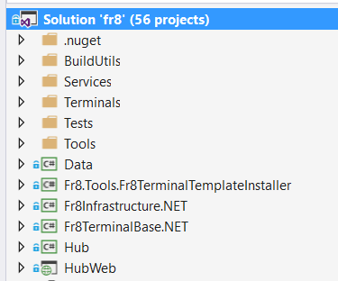
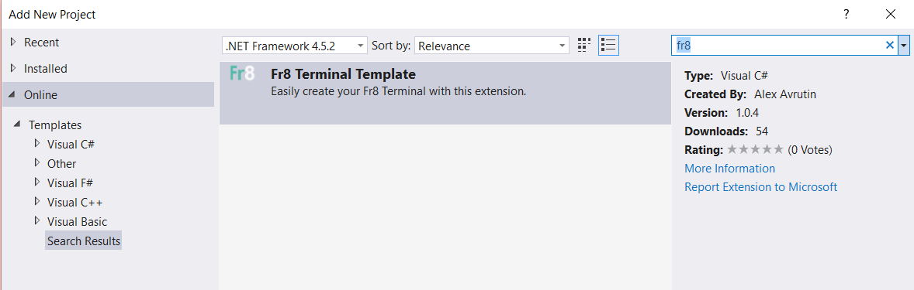
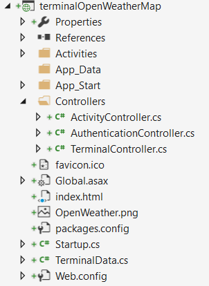
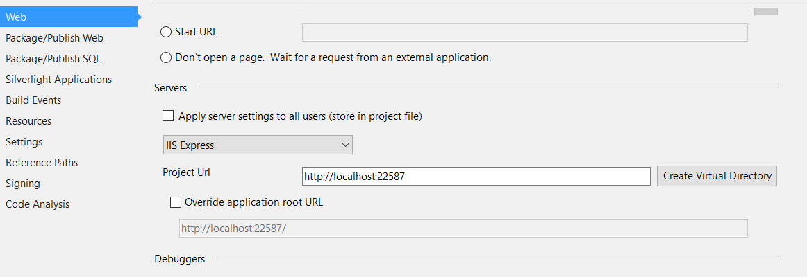
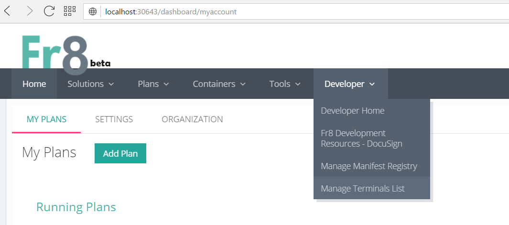
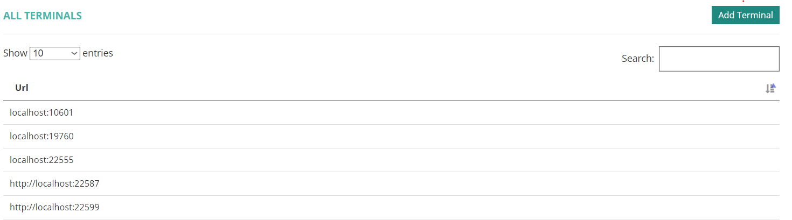
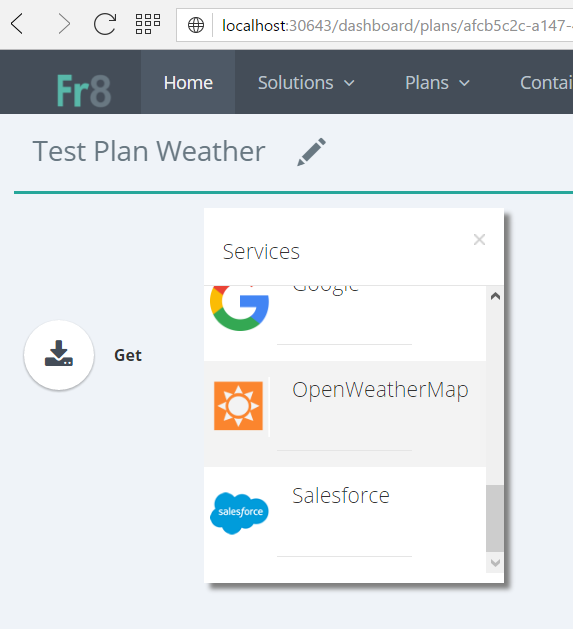
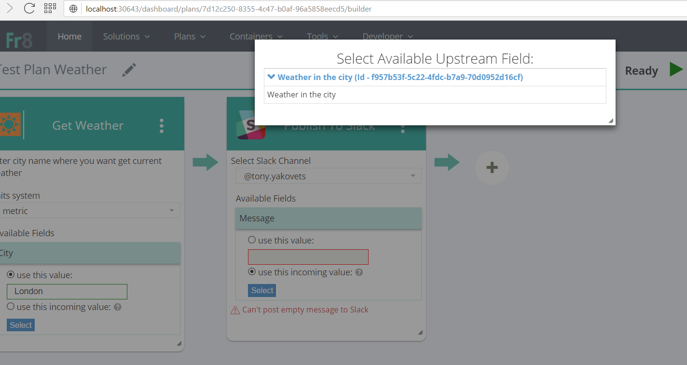
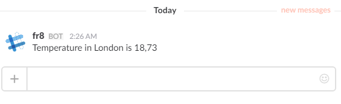

Before doing this tutorial, you may want to try [this one](https://github.com/Fr8org/Fr8Core/blob/FR-3375/Docs/ForDevelopers/DevelopmentGuides/TerminalTutorial-Part1.md).

We'll build a Terminal that communicates with OpenWeatherMap.org and provides the Activity "Get Weather".

### Before Starting
Get an ApiKey from OpenWeatherMap.org. To do this, register an account for this and obtain a key:

Decide on how you'll [test against a Hub](https://github.com/Fr8org/Fr8Core/blob/FR-3375/Docs/ForDevelopers/DevelopmentGuides/Terminal%20-%20Testing%20and%20Operations.md)For this terminal we will run a local hub.

## Step 1 - Clone the Fr8 repo.
Clone [Fr8](https://github.com/Fr8org/Fr8.NET "Fr8 public repository"). This repository contains the Hub and a bunch of Terminals.  
After doing so, your solution tree should look like this:

## Step 2 - Create a new project in VS.
We recommend using the Fr8 Visual Studio Project Template. Add *New Project* and type *Fr8* in search box, you should see online template

 

Enter a name of the terminal you want to build (it could look like terminal%ServiceName%). This will generate:

## Step 3 - Specify your TerminalData Information

The TerminalData class, which can be found in the root of Terminal projects, contains information about your Terminal and any Web Services it works with.  

    namespace terminalOpenWeatherMap
    {
        public static class TerminalData
        {
            public static WebServiceDTO WebServiceDTO = new WebServiceDTO
            {
                Name = "OpenWeatherMap",
                IconPath = "http://localhost:22587/OpenWeather.png"
            };

            public static TerminalDTO TerminalDTO = new TerminalDTO
            {
                Endpoint = CloudConfigurationManager.GetSetting("terminalOpenWeatherMap.TerminalEndpoint"),
                TerminalStatus = TerminalStatus.Active,
                Name = "terminalOpenWeatherMap",
                Label = "OpenWeatherMap",
                Version = "1"
            };
        }
    }

The *Endpoint* value specifies the URL where the Hub will attempt to contact your Terminal. (CloudConfigurationManager is a Microsoft Azure construct that first checks Azure configuration settings and then looks in web.config). Look in  **web.config** file, and you'll see that a URL (including a port) is specified.  

    <appSettings>
        <add key="DefaultHubURL" value="http://localhost:30643/" />
        <add key="HubApiVersion" value="v1" />
        <add key="terminalOpenWeatherMap.TerminalEndpoint" value="http://localhost:22587" />
        <add key="TerminalId" value="6a5c763f-4355-49c1-8b25-3e0423d7ecde" />
        
        <add key="ApiKey" value="%%%_some_api_key_value_%%%" />
        <add key="СityWeatherUrl" value="http://api.openweathermap.org/data/2.5/weather?q=%CITY%&amp;APPID=%APPKEY%&amp;units=%UNIT%" />
        
    </appSettings>

 *DefaultHubURL* is the Hub url that the Terminal will attempt to contact.  
 *TerminalId* is a GUID for identify this terminal (also in case of many Hubs registrations) 

All sensitive information like *ApiKey* and different *ClientSecret* should not be stored in public repositories, use external private settings package for this.  
Once this step is complete, you essentially have a complete response to any /discover call arriving from a Hub.

## Step 4 - Define the ActivityTemplate
In folder **Activities**, rename the file and its class to 'Get_Weather_v1'. In Fr8,  Activities are named using snake_case notation with '_v%number%' at the end.

Activities are responsible for generating an ActivityTemplate that will be handed to the Hub as part of the /discover Response, and used by the Client to display the Activity as a choice to the user. Update the Activity as shown below:

     public class Get_Weather_v1 : TerminalActivity<Get_Weather_v1.ActivityUi>
     {
        public static ActivityTemplateDTO ActivityTemplateDTO = new ActivityTemplateDTO
        {
            Id = new Guid("7cd268c9-95b6-491d-bd92-388ea4b6ab09"),
            Name = "Get_Weather",
            Label = "Get Weather",            
            Version = "1",
            MinPaneWidth = 330,
            WebService = TerminalData.WebServiceDTO,
            Terminal = TerminalData.TerminalDTO,
            Categories = new[] {
                ActivityCategories.Receive,
                new ActivityCategoryDTO(TerminalData.WebServiceDTO.Name, TerminalData.WebServiceDTO.IconPath)
            }
        };
        protected override ActivityTemplateDTO MyTemplate => ActivityTemplateDTO;
        private const string RunTimeCrateLabel = "Weather in the City";
        .....        

## Step 5 - Specify the UI that the User Should See

[UI controls](https://github.com/Fr8org/Fr8Core/blob/master/Docs/ForDevelopers/DevelopmentGuides/ConfigurationControls.md) are specified using JSON. However, in this tutorial, we'll take advantage of helper tools in the .NET Fr8 SDK that allow us to use POCO to specify our UI. To do this, we create an ActivityUI class:

    public ActivityUi()
            {
                Annotation = new TextBlock
                {                   
                    Label = "Enter city name where you want get current weather",
                    Name = nameof(Annotation),
                    Source = new FieldSourceDTO
                    {
                        RequestUpstream = true
                    }
                };
                Units = new DropDownList
                {
                    Label = "Units system",
                    Name = nameof(Units),
                    Required = true,
                    ListItems = new List<ListItem>
                    { 
                        new ListItem() { Key = "metric", Selected = false, Value = "metric"},
                        new ListItem() { Key = "imperial", Selected = false, Value = "imperial"},
                        new ListItem() { Key = "Kelvin", Selected = true, Value = ""},
                    },
                    Value = "metric",
                    selectedKey = "metric"
                };
                City = new TextSource
                {
                    InitialLabel = "City",
                    Label = "City",
                    Name = nameof(City),
                    Source = new FieldSourceDTO
                    {
                        RequestUpstream = true
                    }
                };
                Controls = new List<ControlDefinitionDTO> { Annotation, Units, City };
            }
        }

When the user adds this Activity to a Plan, the Client will render this UI in the Activity's panel.  

## Step 6 - Add Support for Configuration

Configuration (also known as Design-Time) is one of the two main modes an Activity needs to support. In our example, the configuration requirements are pretty simple. 

        public Get_Weather_v1(ICrateManager crateManager)
            : base(crateManager)
        {
        }

        public override Task Initialize()
        {
            var resultField = new FieldDTO(RunTimeCrateLabel, AvailabilityType.RunTime);
            CrateSignaller.MarkAvailableAtRuntime<StandardPayloadDataCM>(RunTimeCrateLabel, true).AddField(resultField);
            return Task.FromResult(0);
        }

Fr8 supports two types of configuration: [Initial and Follow-Up](https://github.com/Fr8org/Fr8Core/blob/master/Docs/ForDevelopers/OperatingConcepts/ActivityConfiguration.md). Here we anounce that our activity adds to Payload data with name stored in variable *RunTimeCrateLabel*. This Activity is too simple to require a separate FollowUp behavior, so we just leave it as:   
 

    public override Task FollowUp()
    {
        return Task.FromResult(0);
    }

    protected override Task Validate()
    {
        ValidationManager.ValidateTextSourceNotEmpty(ActivityUI.City, "You should enter city name");
        return Task.FromResult(0);
    }

One thing that *does* happen each time followup /configure calls are received is that the Validate method gets called. (Learn more about [Validation](https://github.com/Fr8org/Fr8Core/blob/master/Docs/ForDevelopers/OperatingConcepts/ActivitiesValidation.md)).   

# Step 7 - Implement Support for /run 

    public override async Task Run()
    {     
        var restClient = new Fr8.Infrastructure.Communication.RestfulServiceClient();

        var url = CloudConfigurationManager.GetSetting("СityWeatherUrl");
        var apiKey = CloudConfigurationManager.GetSetting("ApiKey");

        var cityName = ActivityUI.City.GetValue(Payload);
        var unit = ActivityUI.Units.Value;
        url = url.Replace("%CITY%", cityName);
        url = url.Replace("%APPKEY%", apiKey);
        url = url.Replace("%UNIT%", unit);

        var weather = await restClient.GetAsync<JObject>(new Uri(url));
        var temp = weather.GetValue("main") as JObject;
        var result = $"Temperature in {cityName} is {temp.GetValue("temp")}";

        var payload = new StandardPayloadDataCM(new List<KeyValueDTO>() { new KeyValueDTO(RunTimeCrateLabel, result)});

        Payload.Add(RunTimeCrateLabel,payload);
    }
 Our code forms a RESTful call and posts it off to OpenWeatherMap.org. The .NET SDK includes a helper called RestfulServiceClient. Note the use of async calls (strongly recommended). The return value is parsed and formed into a string called result.
 
 We add our data to the PayloadContainer with the last two lines. First we build a Crate with a StandardPayloadDataCM Manifest. This is the lowest common denominator manifest, useful for simple key value pairs. We then add it to Payload, another service of the SDK, and the SDK will handle the return of the modified Payload Container to the Hub for us.  

## Step 8 - Turn on the Activity
To bring this Activity 'live', add it to the Terminal's RegisterActivities method in Startup.cs 

    protected override void RegisterActivities()
    {
        ActivityStore.RegisterActivity<Activities.Get_Weather_v1>(Activities.Get_Weather_v1.ActivityTemplateDTO);
    } 

## Step 9 - Run your Terminal 

a) Set Project Properties
In Visual Studio, go to Project Properties and make sure that the Url there matches the Url in terminalOpenWeatherMap.TerminalEndpoint in web.config. This ensures that messages from the Hub will go to the right place. (If you're not running a local Hub, you'll want to set this to a URL that's visible from the public Internet. We use ngrok when we want to facilitate this):

b) Set Solution Properties
Go to Solution Properties and configure Startup Project to start Multiple startup projects. Make sure that your Terminal project is set to Start. If you're running the Hub locally, set it to start as well. Finally, set any other Terminals you want to run locally. In this example, we'll use Slack as a publication channel for our weather data, so we'll start the Slack Terminal. 

c) Run the Solution 
Your Terminal should now be live and listening for requests.

d) Register your Terminal with your local Hub
After you register an account with your local Fr8 Hub and sign in, choose *Manage Terminals List* in *Developer* swction of navbar menu. (You may need to toggle the Developer menu on from the Tools menu).

Add the URL of your Terminal.

## Step 10 - Build a plan 
You should now be able to select your Activity from inside the Plan Builder. Let's create a new plan using our Activity.

Add Get_Weather Activity and Publish_to_Slack (from *Forwarders*) next to it. (We like using Slack in examples because it's free and provides instantaneous responses. However, feel free to use the Send Email or Send SMS Activities). 

Configure Get Weather Activity by entering the name of a city in *City* field.

Configure the Publish to Slack Activity to source it's message text from the upstream "Weather" property that is being generated by the Get Weather Activity. 
 

## Step 11 - Run the plan

You should see updates in the Activity Stream bar at right side of your screen as the Hub processes your Plan, and you should finally see a message in Slack.
 

Continue to [Part 3](./TerminalTutorial-Part3.md).
