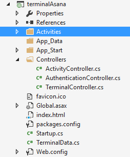
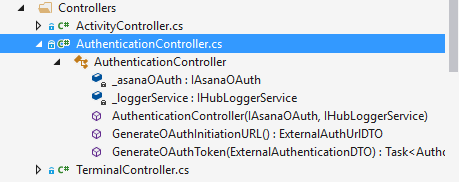
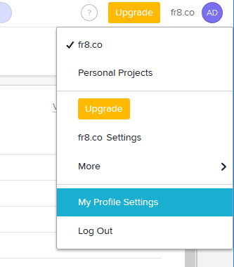
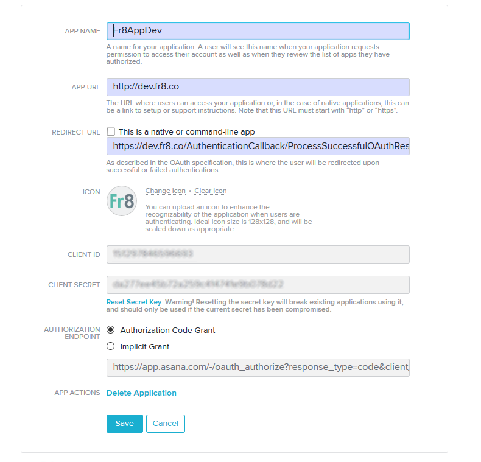
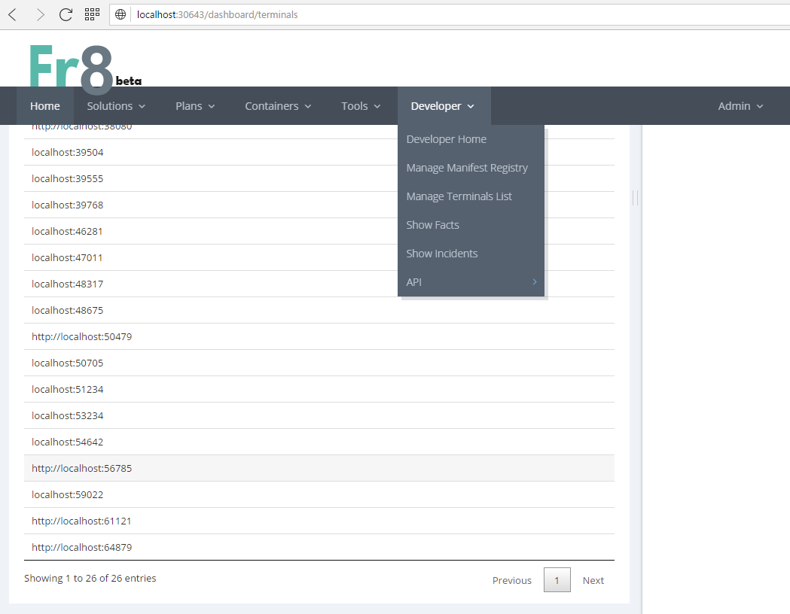
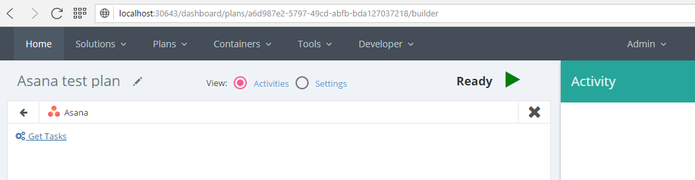
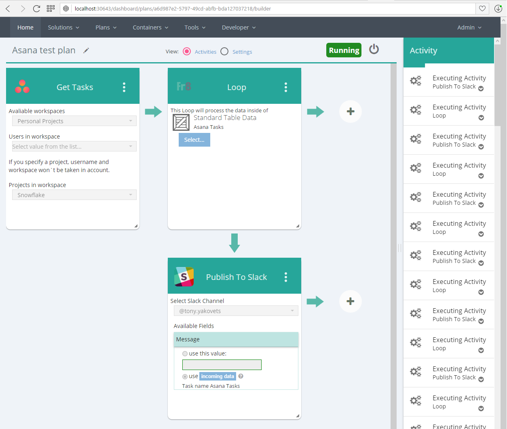

## Terminal Walkthrough: Asana.com - helps you organize your todo list into projects.
### This walkthrough shows how to build a Terminal that uses OAuth to connect to a Web Service (in this example, Asana)

## Before starting...

1. Make sure you're familiar with [the basics of Fr8 OAuth](/Docs/ForDevelopers/DevelopmentGuides/Terminals/dotNet/TerminalDeveloping-Authentication.md).

2. Look around for available SDK's for the Web Service you're connecting to. OAuth is often wrapped in useful utilities in such libraries. But you don't need them. 

3. [Read the documentation](/Docs/ForDevelopers/DevelopmentGuides/Terminals/dotNet/TerminalDeveloping-Authentication.md) on the Fr8 endpoints that Terminals must support if they have Activities that require Authorization.

## Step 1 - Same as in previous terminal, create new terminal project

We recommend using the Fr8 Visual Studio Project Template. Add *New Project* and type *Fr8* in search box, you should see online template

 

Enter a name of the terminal you want to build (it could look like terminal%ServiceName%). This will generate:

## Step 2 - Fill terminal information
The main difference here from the previous tutorial is that- [*AuthenticationType* property is set to *External*](/Docs/ForDevelopers/OperatingConcepts/Authorization/AuthOverview.md). That means the Hub will initiate an OAuth process when users try to use this Terminal, unless the Hub already has a valid authentication token.
 
 
    namespace terminalAsana
    {
        public static class TerminalData
        {
            public static WebServiceDTO WebServiceDTO = new WebServiceDTO
            {
                Name = "Asana",
                IconPath = "https://asana.com/favicon.ico"
            };

            public static TerminalDTO TerminalDTO = new TerminalDTO
            {
                Endpoint = CloudConfigurationManager.GetSetting("terminalAsana.TerminalEndpoint"),
                TerminalStatus = TerminalStatus.Active,
                AuthenticationType = AuthenticationType.External,
                Name = "terminalAsana",
                Label = "Asana",
                Version = "1"
            };
        }
    }
 

## Step 3 - Implement authentication

#### a) Interaction with external service.
Asana uses OAuth 2.0 spec so we reflect it in *IAsanaOAuth* interface
    

    namespace terminalAsana.Interfaces
    {
        public interface IAsanaOAuth
        {
            OAuthToken          OAuthToken { get; set; }

            event               RefreshTokenEventHandler RefreshTokenEvent;
            
            bool                IsTokenExpired(OAuthToken token);

            Task<OAuthToken>    RefreshOAuthTokenAsync(OAuthToken token);
            Task<OAuthToken>    RefreshTokenIfExpiredAsync(OAuthToken token);

            DateTime            CalculateExpirationTime(int secondsToExpiration);
            string              CreateAuthUrl(string state);
            Task<JObject>       GetOAuthTokenDataAsync(string code);

            bool                IsIntialized { get; }
            Task<IAsanaOAuth>   InitializeAsync(OAuthToken authorizationToken);
        }
    }
 

We create an *OAuthToken* class to store token data:

 
    namespace terminalAsana.Asana
    {
        public class OAuthToken
        {
            [JsonProperty("access_token")]
            public string AccessToken { get; set; }

            [JsonProperty("refresh_token")]
            public string RefreshToken { get; set; }

            /// 

            /// The type of token, in our case: bearer
            /// 

            [JsonProperty("token_type")]
            public string TokenType { get; set; }
            
            /// 

            /// Seconds to expiration, usually 3600
            /// 

            [JsonProperty("expires_in")]
            public int ExpiresIn { get; set; }

            // oAuth returns seconds till expiration, so we need do calculate absolute DataTime value
            public DateTime ExpirationDate { get; set; }
        }
    } 
 

We need to provide event mechanisms for *token refresh* to be able notify the **Hub** in case it happens.  The Fr8 APIs currently support requesting and generating OAuth Tokens, but do not provide any support for token refresh. This Web Service (Asana) requires some token refresh activities, so we'll build those here.

 
    namespace terminalAsana.Asana.Services
    {
        public delegate void RefreshTokenEventHandler(object sender, AsanaRefreshTokenEventArgs e);

        public class AsanaRefreshTokenEventArgs
        {
            public AsanaRefreshTokenEventArgs(OAuthToken token)
            {
                RefreshedToken = token;
            }
            public OAuthToken RefreshedToken { get; set; }
        }
    }
 

In this Terminal most of the OAuth is handled by this AsanaOAuthService. Most of the code involves the handling of refresh tokens. The Terminal determines if the current token has expired and if so, passes in the refresh token to trigger a renewal.

    using System;
    using System.Collections.Generic;
    using System.Net.Http;
    using System.Threading.Tasks;
    using System.Web;
    using Fr8.Infrastructure.Interfaces;
    using Fr8.Infrastructure.Utilities.Configuration;
    using Newtonsoft.Json;
    using Newtonsoft.Json.Linq;
    using terminalAsana.Interfaces;

    namespace terminalAsana.Asana.Services
    {
        public class AsanaOAuthService: IAsanaOAuth
        {
            public event RefreshTokenEventHandler RefreshTokenEvent;

            private IRestfulServiceClient _restfulClient;
            private IAsanaParameters _parameters;

            public OAuthToken OAuthToken { get; set; }
            
            public bool IsIntialized { get; private set; } 

            public AsanaOAuthService(IRestfulServiceClient client, IAsanaParameters parameters)
            {
                _restfulClient = client;
                _parameters = parameters;
                OAuthToken = new OAuthToken();
                IsIntialized = false;
            }

            public DateTime CalculateExpirationTime(int secondsToExpiration)
            {
                return DateTime.UtcNow.AddSeconds(secondsToExpiration);
            }

            public bool IsTokenExpired()
            {
                return IsTokenExpired(this.OAuthToken);
            }

            public bool IsTokenExpired(OAuthToken token)
            {
                return token.ExpirationDate <
                    DateTime.UtcNow.AddMinutes(int.Parse(_parameters.MinutesBeforeTokenRenewal));
            }

            public async Task<OAuthToken> RefreshTokenIfExpiredAsync()
            {
                if (!this.IsTokenExpired())
                    return this.OAuthToken;
                else
                    return await RefreshOAuthTokenAsync().ConfigureAwait(false);
            }

            public async Task<OAuthToken> RefreshTokenIfExpiredAsync(OAuthToken token)
            {
                if (!this.IsTokenExpired(token))
                    return token;
                else
                    return await RefreshOAuthTokenAsync(token).ConfigureAwait(false);       
            }

            public async Task<OAuthToken> RefreshOAuthTokenAsync()
            {
                var refreshedToken = await RefreshOAuthTokenAsync(this.OAuthToken).ConfigureAwait(false);
                this.OAuthToken = refreshedToken;

                // replace access_token field on server
                RefreshTokenEvent?.Invoke(this, new AsanaRefreshTokenEventArgs(refreshedToken));         
                
                return this.OAuthToken;
            }

            public async  Task<OAuthToken> RefreshOAuthTokenAsync(OAuthToken token)
            {         
                var url = CloudConfigurationManager.GetSetting("AsanaOAuthTokenUrl");
                
                var contentDic = new Dictionary<string, string>()
                {
                    {"grant_type", "refresh_token" },
                    {"client_id", _parameters.AsanaClientId },
                    {"client_secret", _parameters.AsanaClientSecret},
                    {"refresh_token",this.OAuthToken.RefreshToken}
                };

                var content = new FormUrlEncodedContent(contentDic);
                var jsonObj = await _restfulClient.PostAsync<JObject>(new Uri(url), content).ConfigureAwait(false);
                var refreshedToken = JsonConvert.DeserializeObject<OAuthToken>(jsonObj.ToString());
                refreshedToken.ExpirationDate = this.CalculateExpirationTime(refreshedToken.ExpiresIn);

                return refreshedToken;
            }

            public string CreateAuthUrl(string state)
            {
                var redirectUri = _parameters.AsanaOriginalRedirectUrl;
                var resultUrl = _parameters.AsanaOAuthCodeUrl;
                resultUrl = resultUrl.  Replace("%STATE%", state).
                                        Replace("%REDIRECT_URI%", redirectUri);
                return resultUrl;
            }

            public async Task<JObject> GetOAuthTokenDataAsync(string code)
            {
                var url = _parameters.AsanaOAuthTokenUrl;
                var contentDic = new Dictionary<string, string>()
                {
                    {"grant_type", "authorization_code" },
                    {"client_id", _parameters.AsanaClientId },
                    {"client_secret", _parameters.AsanaClientSecret },
                    {"redirect_uri", HttpUtility.UrlDecode(_parameters.AsanaOriginalRedirectUrl) },
                    {"code",HttpUtility.UrlDecode(code)}
                };
                
                var content = new FormUrlEncodedContent(contentDic);
                var jsonObj = await _restfulClient.PostAsync<JObject>(new Uri(url), content).ConfigureAwait(false);

                return jsonObj;
            }        

            public async Task<IAsanaOAuth> InitializeAsync(OAuthToken authorizationToken)
            {
                try
                {
                    this.OAuthToken = authorizationToken;
                    this.OAuthToken = await this.RefreshTokenIfExpiredAsync().ConfigureAwait(false);
                    this.IsIntialized = true;
                }
                catch (Exception exp)
                {
                    throw new Exception("Error while initializing AsanaOAuthService, bad AuthorizationToken", exp);
                }
                return this;
            }
        }
    }

We add a couple of helper methods like *public bool IsTokenExpired()* which duplicates interface method, but uses internal token object. Constructor takes interfaces for parameters and REST client. 

The AsanaParametersService stores all neccessary constants and variables meaningful for asana interaction.

    using Fr8.Infrastructure.Utilities.Configuration;
    using terminalAsana.Interfaces;

    namespace terminalAsana.Interfaces
    {
        public interface IAsanaParameters
        {
            string ApiVersion           { get; }
            string DomainName           { get; }
            string ApiEndpoint          { get; }
            string AsanaClientSecret    { get; }
            string AsanaClientId        { get; }

            /// 

            /// The number of objects to return per page. The value must be between 1 and 100.
            /// 

            string Limit                { get; }

            /// 

            /// Example eyJ0eXAiOJiKV1iQLCJhbGciOiJIUzI1NiJ9
            /// An offset to the next page returned by the API.A pagination request will return an offset token, which can be used as an input parameter to the next request.If an offset is not passed in, the API will return the first page of results.
            /// Note: You can only pass in an offset that was returned to you via a previously paginated request.
            /// 

            string Offset               { get; }

            string MinutesBeforeTokenRenewal{ get; }
            string AsanaOriginalRedirectUrl { get; }
            string AsanaOAuthCodeUrl        { get; }
            string AsanaOAuthTokenUrl       { get; } 
                    
            string WorkspacesUrl        { get; }
            string TasksUrl             { get; }
            string UsersUrl             { get; }
            string UsersInWorkspaceUrl  { get; }
            string UsersMeUrl           { get; }
            string StoriesUrl           { get; }
            string StoryUrl             { get; }
            string ProjectsUrl          { get; }
            string ProjectUrl           { get; }
            string ProjectTasksUrl      { get; }
            string ProjectSectionsUrl   { get; }
        }
    }

    namespace terminalAsana.Asana.Services
    {
        public class AsanaParametersService : IAsanaParameters
        {
            public string AsanaClientSecret     { get; set; }
            public string AsanaClientId         { get; set; }

            public string ApiVersion            { get; set; }
            public string DomainName            { get; set; }
            public string ApiEndpoint => this.DomainName + this.ApiVersion;

            public string Limit                 { get; set; }
            public string Offset                { get; }

            //<!--OAuth section-->
            public string MinutesBeforeTokenRenewal { get; set; }
            public string AsanaOriginalRedirectUrl  { get; set; }
            public string AsanaOAuthCodeUrl         { get; set; }
            public string AsanaOAuthTokenUrl        { get; set; }

            //<!--API URL`s-->
            public string WorkspacesUrl => this.ApiEndpoint + "/workspaces";
            public string TasksUrl => this.ApiEndpoint + "/tasks";
            public string UsersUrl => this.ApiEndpoint + "/users/{user-id}";
            public string UsersInWorkspaceUrl => this.ApiEndpoint + "/workspaces/{workspace-id}/users";
            public string UsersMeUrl => this.ApiEndpoint + "/users/me";
            public string StoriesUrl => this.ApiEndpoint + "/tasks/{task-id}/stories";
            public string StoryUrl => this.ApiEndpoint + "/stories/{story-id}";
            public string ProjectsUrl => this.ApiEndpoint + "/projects";
            public string ProjectUrl => this.ApiEndpoint + "/projects/{project-id}";
            public string ProjectTasksUrl => this.ApiEndpoint + "/projects/{project-id}/tasks";
            public string ProjectSectionsUrl => this.ApiEndpoint + "/projects/{project-id}/sections";

            public AsanaParametersService()
            {
                ApiVersion = "1.0";
                DomainName = "https://app.asana.com/api/";

                Limit = CloudConfigurationManager.GetSetting("AsanaNumberOfObjectsLimit");

                AsanaClientSecret = CloudConfigurationManager.GetSetting("AsanaClientSecret");
                AsanaClientId = CloudConfigurationManager.GetSetting("AsanaClientId");

                MinutesBeforeTokenRenewal = CloudConfigurationManager.GetSetting("MinutesBeforeTokenRenewal");
                AsanaOriginalRedirectUrl = CloudConfigurationManager.GetSetting("CoreWebServerUrl") + CloudConfigurationManager.GetSetting("AsanaOriginalRedirectUrl");
                AsanaOAuthCodeUrl = CloudConfigurationManager.GetSetting("AsanaOAuthCodeUrl").Replace("%ASANA_CLIENT_ID%",AsanaClientId);
                AsanaOAuthTokenUrl = CloudConfigurationManager.GetSetting("AsanaOAuthTokenUrl");
            }
        }
    }

#### b) Auth Interaction between Terminal and Hub.
Let`s look at *AuthenticationController* inside our Terminal *Controllers* folder

The Fr8 **Hub** stores and recives user secrets from third party services. First the Hub requests from our terminal a url where it can aquire a code which will be exchanged for an access token. For this purpose we have *GenerateOAuthInitiationURL()* method which matches `/authentication/request_url` terminal endpoint.

#### с) Constructing the Auth URLs
- In a registered Asana account, navigate to profile settings

	

- Then go to Apps tab and "Manage Developer Apps" at the bottom, there you will see list of applications. Add your new application.

    

In order to proceed successful request we need to pass redirect url. In the example picture we pass 
`https://dev.fr8.co/AuthenticationCallback/ProcessSuccessfulOAuthResponse?terminalName=terminalAsana&terminalVersion=1`
but for local development usually using Hub at *http://localhost:30643/* &nbsp;
The Hub's AuthenticationCallback controller determine terminal and its version and passes returned query string to our terminal.

#### d) Process returned token values
At this point, the user has see our asana oauth dialog box and  confirmed access. The Hub has received a request from the Client with token data in query string and wants to  pass it to our terminal.

This work will be done by *GenerateOAuthToken(ExternalAuthenticationDTO externalAuthDTO)* method at `/authentication/token` endpoint.
Through this endpoint we receive the *code* we can exchange for a token, which we pass back to the Hub for storage.

Here's the AuthentificationController:
    

    using System;
    using System.Threading.Tasks;
    using System.Web;
    using System.Web.Http;
    using Fr8.Infrastructure.Data.DataTransferObjects;
    using Fr8.TerminalBase.Services;
    using Newtonsoft.Json.Linq;
    using terminalAsana.Interfaces;

    namespace terminalAsana.Controllers
    {
        [RoutePrefix("authentication")]
        public class AuthenticationController : ApiController
        {
            private readonly IAsanaOAuth _asanaOAuth;
            private readonly IHubLoggerService _loggerService;

            public AuthenticationController(IAsanaOAuth asanaOAuth, IHubLoggerService loggerService)
            {               
                _asanaOAuth = asanaOAuth;
                _loggerService = loggerService;
            }

            [HttpPost]
            [Route("request_url")]
            public ExternalAuthUrlDTO GenerateOAuthInitiationURL()
            {
                var externalStateToken = Guid.NewGuid().ToString();
                var url = _asanaOAuth.CreateAuthUrl(externalStateToken);

                var externalAuthUrlDTO = new ExternalAuthUrlDTO()
                {
                    ExternalStateToken = externalStateToken,
                    Url = url
                };

                return externalAuthUrlDTO;
            }

            [HttpPost]
            [Route("token")]
            public async Task<AuthorizationTokenDTO> GenerateOAuthToken(ExternalAuthenticationDTO externalAuthDTO)
            {
                try
                {
                    var query = HttpUtility.ParseQueryString(externalAuthDTO.RequestQueryString);
                    string code = query["code"];
                    string state = query["state"];

                    if (string.IsNullOrEmpty(code) || string.IsNullOrEmpty(state))
                    {
                        throw new ApplicationException("Code or State is empty.");
                    }

                    var oauthTokenData = await _asanaOAuth.GetOAuthTokenDataAsync(code);
                    var userInfo = oauthTokenData.Value<JObject>("data");
                    var secondsToExpiration = oauthTokenData.Value<int>("expires_in");
                    var expirationDate = _asanaOAuth.CalculateExpirationTime(secondsToExpiration);

                    return new AuthorizationTokenDTO
                    {
                        Token = oauthTokenData.ToString(),
                        ExternalAccountId = userInfo.Value<string>("id"),
                        ExternalAccountName = userInfo.Value<string>("name"),
                        ExternalStateToken = state,
                        ExpiresAt = expirationDate,
                        AdditionalAttributes = expirationDate.ToString("O")
                    };
                }
                catch (Exception ex)
                {
                    await _loggerService.ReportTerminalError(ex, externalAuthDTO.Fr8UserId);

                    return new AuthorizationTokenDTO()
                    {
                        Error = "An error occurred while trying to authorize, please try again later."
                    };
                }
            }
        }
    }

## Step 4 - Create SDK for external service
Here we build additional services into the Terminal. This makes life easier for Activity builders and enhancers that may follow you. Of course, if there's already an SDK for your platform, much of this won't be necessary or add value.

To interact with Asana using OAuth without thinking about token refreshing we will crate *IAsanaOAuthCommunicator* based on *IRestClientService*

    using System;
    using System.Collections.Generic;
    using System.Net.Http;
    using System.Linq;
    using System.Threading.Tasks;
    using Fr8.Infrastructure.Interfaces;
    using terminalAsana.Interfaces;

    namespace terminalAsana.Interfaces
    {
        public interface IAsanaOAuthCommunicator 
        {
            IAsanaOAuth OAuthService { get; set; }
            Task<Dictionary<string, string>> PrepareHeader(Dictionary<string, string> existingHeaders);

            //what was left from IRestClientService
            Task<TResponse> GetAsync<TResponse>(Uri requestUri, string CorrelationId = null, Dictionary<string, string> headers = null);
            Task<TResponse> PostAsync<TResponse>(Uri requestUri, string CorrelationId = null,Dictionary<string, string> headers = null);
            Task<TResponse> PostAsync<TResponse>(Uri requestUri, HttpContent content, string CorrelationId = null, Dictionary<string, string> headers = null);
        }
    }

    namespace terminalAsana.Asana.Services
    {
        
        public class AsanaCommunicatorService : IAsanaOAuthCommunicator
        {
            public IAsanaOAuth OAuthService { get; set;}

            private IRestfulServiceClient _restfulClient;

            public AsanaCommunicatorService(IAsanaOAuth oauth, IRestfulServiceClient client)
            {
                OAuthService = oauth;
                _restfulClient = client;
            }

            /// 

            /// Add OAuth access_token to headers
            /// 

            /// <param name="currentHeader"></param>
            /// <returns></returns>
            public async Task<Dictionary<string,string>> PrepareHeader(Dictionary<string,string> currentHeader)
            {
                var token = await OAuthService.RefreshTokenIfExpiredAsync();
                var headers = new Dictionary<string, string>()
                {
                    {"Authorization", $"Bearer {token.AccessToken}"},
                };
                
                var combinedHeaders = currentHeader?.Concat(headers).ToDictionary(k => k.Key, v => v.Value) ?? headers;
                return combinedHeaders;
            }

            public async Task<TResponse> GetAsync<TResponse>(Uri requestUri, string CorrelationId = null, Dictionary<string, string> headers = null)
            {
                var header = await PrepareHeader(headers);             
                var response = await _restfulClient.GetAsync<TResponse>(requestUri, CorrelationId, header);
                return response;
            }

            public async Task<TResponse> PostAsync<TResponse>(Uri requestUri, string CorrelationId = null, Dictionary<string, string> headers = null)
            {
                var header = await PrepareHeader(headers);
                var response = await _restfulClient.PostAsync<TResponse>(requestUri, CorrelationId, header);
                return response;
            }

            public async Task<TResponse> PostAsync<TResponse>(Uri requestUri, HttpContent content, string CorrelationId = null, Dictionary<string, string> headers = null)
            {
                var header = await PrepareHeader(headers);
                var response = await _restfulClient.PostAsync<TResponse>(requestUri, content, CorrelationId, header);
                return response;
            }
        }
    }

We will create couple key interfaces and plain class objects for Asana entities. 
The Activity we are going to create named 'Get tasks' so you can implement all primary entities that will be used here, they can pull bunch of all other entities so you just can skip them or define as simple string values.

    using System;
    using System.Collections.Generic;
    using System.Linq;
    using System.Web;
    using Newtonsoft.Json;
    using terminalAsana.Interfaces;

    namespace terminalAsana.Asana.Entities
    {
        public class AsanaWorkspace 
        {
            [JsonProperty("id")]
            public string Id { get; set; }
            
            [JsonProperty("name")]
            public string Name { get; set; }
            
            [JsonProperty("is_organization")]
            public bool IsOrganization { get; set; }
        }
        
        public class AsanaUser 
        {
            [JsonProperty("id")]
            public string Id { get; set; }

            [JsonProperty("name")]
            public string Name { get; set; }

            [JsonProperty("email")]
            public string Email { get; set; }

            [JsonProperty("photo")]
            public IDictionary<string,string> Photo{ get; set; }

            [JsonProperty("workspaces")]
            public IEnumerable<AsanaWorkspace> Workspaces { get; set; }
        }
        
        public class AsanaTask 
        {
            [JsonProperty("id")]
            public string Id { get; set; }

            [JsonProperty("assignee")]
            public AsanaUser Assignee { get; set; }

            [JsonProperty("assignee_status")]
            public string AssigneeStatus { get; set; }

            [JsonProperty("created_at")]
            public DateTime CreatedAt { get; set; }

            [JsonProperty("completed")]
            public bool Completed { get; set; }

            [JsonProperty("completed_at")]
            public DateTime? CompletedAt { get; set; }

            [JsonProperty("due_on")]
            public DateTime? DueOn { get; set; }

            [JsonProperty("due_at")]
            public DateTime? DueAt { get; set; }

            [JsonProperty("external")]
            public string External { get; set; }

            [JsonProperty("followers")]
            public IEnumerable<AsanaUser> Followers { get; set; }

            [JsonProperty("hearted")]
            public bool Hearted { get; set; }

            [JsonProperty("hearts")]
            public IEnumerable<AsanaUser> Hearts  { get; set; }
            
            [JsonProperty("modified_at")]
            public DateTime ModifiedAt { get; set; }

            [JsonProperty("name")]
            public string Name { get; set; }

            [JsonProperty("notes")]
            public string Notes { get; set; }

            [JsonProperty("num_hearts")]
            public int NumHearts { get; set; }

            [JsonProperty("parent")]
            public AsanaTask Parent { get; set; }

            [JsonProperty("workspace")]
            public AsanaWorkspace Workspace { get; set; }

            //[JsonProperty("projects")]
            //public IEnumerable<AsanaProject> Projects { get; set; }

            //[JsonProperty("memberships")]
            //public IEnumerable<AsanaMembership> Memberships { get; set; }

            //[JsonProperty("tags")]
            //public IEnumerable<AsanaTag> Tags { get; set; }
        }
    }

Those entities will be used by services which represent Asana API.  

    using System;
    using System.Collections.Generic;
    using System.Linq;
    using System.Web;
    using Newtonsoft.Json;
    using terminalAsana.Interfaces;

    namespace terminalAsana.Interfaces
    {
        public interface IAsanaUsers
        {
            Task<AsanaUser>                 MeAsync();
            Task<AsanaUser>                 GetUserAsync(string id);
            Task<IEnumerable<AsanaUser>>    GetUsersAsync(string workspaceId);
        }

        public interface IAsanaWorkspaces
        {

            //Task<bool>                      UpdateWorkspaceAsync(AsanaWorkspace workspace);
            //Task<AsanaWorkspace>            GetAsync(int id);
            
            Task<IEnumerable<AsanaWorkspace>> GetAsync();
            
            //Task<AsanaWorkspace>            UpdateAsync(AsanaWorkspace workspace);
            //Task<IEnumerable<string>>       SearchAsync(WorkspaceSearchQuery query);
            //Task<AsanaUser>                 AddUserAsync(AsanaUser user);
            //Task<bool>                      RemoveUserAsync(AsanaUser user);
        }

        public interface IAsanaTasks
        {
            //Task<AsanaTask>                 CreateAsync(AsanaTask task);
            //Task<AsanaTask>                 GetAsync(string id);
            //Task<AsanaTask>                 UpdateAsync(AsanaTask task);
            //Task                            DeleteAsync(AsanaTask task);

            Task<IEnumerable<AsanaTask>>      GetAsync(AsanaTaskQuery query);

            //Task<IEnumerable<AsanaTask>>    GetAllSubtasksAsync(string taskId);
            //Task<AsanaTask>                 CreateSubTaskAsync(AsanaTask task);
            //Task                            SetParentTaskAsync(AsanaTask task);
            //Task<IEnumerable<AsanaStory>>   GetStoriesAsync(string taskId);
            //Task<IEnumerable<AsanaProject>> GetProjectsAsync(string taskId);
            //Task                            AddToProjectAsync(AsanaProjectInsertion query);
            //Task                            RemoveFromProject(string taskId, string projectId);
            //Task<IEnumerable<AsanaTag>>     GetTags(string taskId);
            //Task                            AddTag(string taskId, string tagId);
            //Task                            RemoveTag(string taskId, string tagId);
            //Task<AsanaTask>                 AddFollowers(string taskId, IEnumerable<AsanaUser> followers);
            //Task<AsanaTask>                 RemoveFollowers(string taskId, IEnumerable<AsanaUser> followers);
        }
    }

We don`t need all those methods right now, so functionallity which won't be use is commented out.

    using System;
    using System.Collections.Generic;
    using System.Threading.Tasks;
    using Fr8.Infrastructure.Utilities.Logging;
    using Newtonsoft.Json.Linq;
    using terminalAsana.Asana.Entities;
    using terminalAsana.Interfaces;

    namespace terminalAsana.Asana
    {
        public class Users : IAsanaUsers
        {
            private readonly IAsanaOAuthCommunicator _restfulClient;
            private readonly IAsanaParameters _asanaParams;

            public Users(IAsanaOAuthCommunicator client, IAsanaParameters asanaParams)
            {
                _restfulClient = client;
                _asanaParams = asanaParams;
            }

            public async Task<AsanaUser> MeAsync()
            {
                var uri = new Uri(_asanaParams.UsersMeUrl);

                try
                {
                    var response = await _restfulClient.GetAsync<JObject>(uri);
                    var result = response.GetValue("data").ToObject<AsanaUser>();
                    return result;
                }
                catch (Exception exp)
                {
                    Logger.GetLogger("terminalAsana").Error($"terminalAsana error = {exp.Message}");
                    throw;
                }
            }

            public async Task<AsanaUser> GetUserAsync(string userId)
            {
                var uri = new Uri(_asanaParams.UsersUrl.Replace("{user-id}", userId));

                try
                {
                    var response = await _restfulClient.GetAsync<JObject>(uri);
                    var result = response.GetValue("data").ToObject<AsanaUser>();
                    return result;
                }
                catch (Exception exp)
                {
                    Logger.GetLogger("terminalAsana").Error($"terminalAsana error = {exp.Message}");
                    throw;
                }
            }

            public async Task<IEnumerable<AsanaUser>> GetUsersAsync(string  workspaceId)
            {
                var uri = new Uri(_asanaParams.UsersInWorkspaceUrl.Replace("{workspace-id}", workspaceId));

                try
                {
                    var response = await _restfulClient.GetAsync<JObject>(uri);
                    var result = response.GetValue("data").ToObject<IEnumerable<AsanaUser>>();
                    return result;
                }
                catch (Exception exp)
                {
                    Logger.GetLogger("terminalAsana").Error($"Error = {exp.Message}");
                    throw;
                }
                
            }
        }
    }

    namespace terminalAsana.Asana
    {
        public class Workspaces : IAsanaWorkspaces
        {
            private IAsanaOAuthCommunicator _restClient;
            private IAsanaParameters _asanaParams;

            public Workspaces(IAsanaOAuthCommunicator client, IAsanaParameters asanaParams)
            {
                _restClient = client;
                _asanaParams = asanaParams;
            }

            public async Task<IEnumerable<AsanaWorkspace>> GetAsync()
            {
                var uri = new Uri(_asanaParams.WorkspacesUrl);
                try
                {
                    var response = await _restClient.GetAsync<JObject>(uri).ConfigureAwait(false);
                    var result = response.GetValue("data").ToObject<IEnumerable<AsanaWorkspace>>();
                    return result;
                }
                catch (Exception exp)
                {
                    Logger.GetLogger("terminalAsana").Error($"terminalAsana error = {exp.Message}");
                    throw;
                }
            }
    }

    namespace terminalAsana.Asana.Services
    {
        public class Tasks : IAsanaTasks
        {
            private IAsanaOAuthCommunicator _restClient;
            private IAsanaParameters _asanaParams;

            public Tasks(IAsanaOAuthCommunicator client, IAsanaParameters parameters)
            {
                _asanaParams = parameters;
                _restClient = client;
            }

            public async Task<IEnumerable<AsanaTask>> GetAsync(AsanaTaskQuery query)
            {
                var baseUrl = _asanaParams.TasksUrl + "?";
                var url = baseUrl;
                url = query.Workspace != null ? url + $"workspace={query.Workspace}&": url;
                url = query.Assignee != null  ? url + $"assignee={query.Assignee}&" : url + $"assignee=me&";
                url = query.Project != null ? baseUrl + $"project={query.Project}&" : url;
                url = query.Tag != null ? baseUrl + $"tag={query.Tag}" : url;
                url = query.CompletedSince != null  ? url + $"completed_since={query.CompletedSince}&" : url;
                url = query.ModifiedSince != null ? url + $"modified_since={query.ModifiedSince}&" : url;
                
                var uri = new Uri(url);

                try
                {
                    var response = await _restClient.GetAsync<JObject>(uri);
                    var result = response.GetValue("data").ToObject<IEnumerable<AsanaTask>>();
                    return result;
                }
                catch (Exception exp)
                {
                    Logger.GetLogger("terminalAsana").Error($"terminalAsana error = {exp.Message}");
                    throw;
                }
            }
        }
    }

Finally unite all those class to single *client*

    using Fr8.Infrastructure.Interfaces;
    using terminalAsana.Interfaces;

    namespace terminalAsana.Asana.Services
    {
        public class AsanaClient
        {
            //- Communication logic -
            public IAsanaOAuth      OAuth       { get; set; }
            public IAsanaParameters Parameters  { get; set; }
            protected IAsanaOAuthCommunicator  RestCommunicator { get; set; }  

            //- Business logic -
            public IAsanaTasks      Tasks       { get; set; }
            public IAsanaUsers      Users       { get; set; }
            public IAsanaWorkspaces Workspaces  { get; set; }

            public AsanaClient(IAsanaParameters parameters, IRestfulServiceClient client)
            {
                Parameters = parameters;   

                OAuth = new AsanaOAuthService(client, Parameters);
                RestCommunicator = new AsanaCommunicatorService(OAuth, client);

                Tasks= new Tasks(RestCommunicator,Parameters);
                Users = new Users(RestCommunicator, Parameters);
                Workspaces = new Workspaces(RestCommunicator, Parameters);
            }
        }
    }

## Step 5 - Defining Crate Manifests
We want to define one or more Asana-centric [Crate Manifests](/Docs/ForDevelopers/Objects/CratesManifest.md) so we can pass structured data to and from other Asana Activities. 

Here we define a Crate containing a List of Asana Tasks, and a Crate containing a single Asana Task:

    using System;
    using System.Collections.Generic;
    using Fr8.Infrastructure.Data.Constants;

    namespace Fr8.Infrastructure.Data.Manifests
    {
        public class AsanaTaskCM:Manifest
        {
            public string Id { get; set; }
            public string Assignee { get; set; }
            public string AssigneeStatus { get; set; }
            public DateTime CreatedAt { get; set; }
            public bool Completed { get; set; }
            public DateTime? CompletedAt { get; set; }
            public DateTime? DueOn { get; set; }
            public DateTime? DueAt { get; set; }
            public string External { get; set; }
            public IEnumerable<string> Followers { get; set; }
            public bool Hearted { get; set; }
            public IEnumerable<string> Hearts { get; set; }
            public DateTime ModifiedAt { get; set; }
            public string Name { get; set; }
            public string Notes { get; set; }
            public int NumHearts { get; set; }
            public IEnumerable<string> Projects { get; set; }
            public string Parent { get; set; }
            public string Workspace { get; set; }
            public IEnumerable<string> Tags { get; set; }

            public AsanaTaskCM():base(MT.AsanaTask)
            {
            }
        }

        public class AsanaTaskListCM : Manifest
        {
            public IEnumerable<AsanaTaskCM> Tasks;

            public AsanaTaskListCM() : base(MT.AsanaTaskList)
            {
            }  
        }
    }

*MT.AsanaTask* here is an int value obtained by registering the Manifests with a Manifest Registry such as the one at [fr8.co](https://fr8.co/manifest_registry)

## Step 6 - Add "Get Tasks" Activity

To make activities development easy for the Terminal we add the AsanaOAuthBaseActivity  class to the **Activities** folder.
The purpose of this class is to handle token interaction. This frees Activity code from having to deal with token issues.

At this point you might ask 'Why isn't more of this auth logic implemented at the SDK level in the TerminalActivity base class?' - the answer is  that there's enough incompatibility between different web service oauth implemetations to make it difficult to generalize beyond where we've gone so far. But we're still working on it.  

    using System;
    using System.Threading.Tasks;
    using AutoMapper;
    using Fr8.Infrastructure.Data.DataTransferObjects;
    using Fr8.Infrastructure.Data.Managers;
    using Fr8.Infrastructure.Data.Manifests;
    using Fr8.Infrastructure.Interfaces;
    using Fr8.Infrastructure.Utilities.Logging;
    using Fr8.TerminalBase.BaseClasses;
    using Newtonsoft.Json.Linq;
    using terminalAsana.Asana;
    using terminalAsana.Asana.Services;
    using terminalAsana.Interfaces;

    namespace terminalAsana.Activities
    {
        public abstract class AsanaOAuthBaseActivity<T> : TerminalActivity<T>
            where T : StandardConfigurationControlsCM
        {
            protected AsanaClient AClient;

            public AsanaOAuthBaseActivity(ICrateManager crateManager, IAsanaParameters parameters, IRestfulServiceClient client) : base(crateManager)
            {
                AClient = new AsanaClient(parameters, client);
            }

            protected override void InitializeInternalState()
            {
                base.InitializeInternalState();
                    
                AClient.OAuth.RefreshTokenEvent += RefreshHubToken;

                var tokenData = JObject.Parse(this.AuthorizationToken.Token);
                var token = new OAuthToken
                {
                    AccessToken = tokenData.Value<string>("access_token"),
                    RefreshToken = tokenData.Value<string>("refresh_token"),
                    ExpirationDate = this.AuthorizationToken.ExpiresAt ?? DateTime.MinValue
                };
                 
                AClient.OAuth = Task.Run(() => AClient.OAuth.InitializeAsync(token)).Result;   
            }

            protected void RefreshHubToken(object sender, AsanaRefreshTokenEventArgs eventArgs)
            {
                var originalTokenData = JObject.Parse(this.AuthorizationToken.Token);
                originalTokenData["access_token"] = eventArgs.RefreshedToken.AccessToken;

                this.AuthorizationToken.AdditionalAttributes = eventArgs.RefreshedToken.ExpirationDate.ToString("O");
                this.AuthorizationToken.ExpiresAt = eventArgs.RefreshedToken.ExpirationDate;
                this.AuthorizationToken.Token = originalTokenData.ToString();
                try
                {
                    var authDTO = Mapper.Map<AuthorizationTokenDTO>(this.AuthorizationToken);
                    Task.Run(() => HubCommunicator.RenewToken(authDTO));
                }
                catch (Exception exp)
                {
                    Logger.GetLogger("terminalAsana").Error($"terminalAsana: Error while token renew:  {exp.Message}", "Asana terminal");
                }
            }
        }
    }

We override the *InitializeInternalState* from the base classes of the SDK because everything we need appears here (not in the class constructor). Also we define *RefreshHubToken* callback which will prepare and renew token data for the hub.   
As like as in previous terminal, we renamed existing or add new file in **Activities** folder to Get_Tasks_v1.cs.

    using System;
    using System.Collections.Generic;
    using System.Linq;
    using System.Threading.Tasks;
    using AutoMapper;
    using Fr8.Infrastructure.Data.Control;
    using Fr8.Infrastructure.Data.Crates;
    using Fr8.Infrastructure.Data.DataTransferObjects;
    using Fr8.Infrastructure.Data.Managers;
    using Fr8.Infrastructure.Data.Manifests;
    using Fr8.Infrastructure.Data.States;
    using Fr8.Infrastructure.Interfaces;
    using Fr8.TerminalBase.Infrastructure;
    using Microsoft.Ajax.Utilities;
    using terminalAsana.Asana.Entities;
    using terminalAsana.Interfaces;

    namespace terminalAsana.Activities
    {
        public class Get_Tasks_v1 : AsanaOAuthBaseActivity<Get_Tasks_v1.ActivityUi>
        {
            public static readonly  ActivityTemplateDTO ActivityTemplateDTO = new ActivityTemplateDTO
            {
                Id = new Guid("4b21e180-8029-4352-a756-52973cd98717"),
                Name = "Get_Tasks",
                Label = "Get Tasks",
                Category = ActivityCategory.Receivers,
                Version = "1",
                MinPaneWidth = 330,
                WebService = TerminalData.WebServiceDTO,
                Terminal = TerminalData.TerminalDTO,
                NeedsAuthentication = true,
                Categories = new[] {
                    ActivityCategories.Receive,
                    new ActivityCategoryDTO(TerminalData.WebServiceDTO.Name, TerminalData.WebServiceDTO.IconPath)
                }
            };
            protected override ActivityTemplateDTO MyTemplate => ActivityTemplateDTO;

Note how  *NeedsAuthentication* attribute is set to **true**, and don't forget to provide a GUID **Id** .

            private const string RunTimeCrateLabel = "Asana Tasks";
            private const string RunTimeCrateLabelCustomCM = "Asana Tasks List";

            public class ActivityUi : StandardConfigurationControlsCM
            {
                public DropDownList WorkspacesList;
                public DropDownList UsersList;
                public DropDownList ProjectsList;
                public TextBlock Information;

                public ActivityUi()
                {
                    WorkspacesList = new DropDownList()
                    {
                        Label = "Avaliable workspaces",
                        Name = nameof(WorkspacesList),
                        ListItems = new List<ListItem>(),
                        Events = new List<ControlEvent> { ControlEvent.RequestConfig },
                    };

                    ProjectsList = new DropDownList()
                    {
                        Label = "Projects in workspace",
                        Name = nameof(ProjectsList),
                        ListItems = new List<ListItem>(),
                        Events = new List<ControlEvent> { ControlEvent.RequestConfig }
                    };

                    Information = new TextBlock()
                    {
                        Name = nameof(Information),
                        Label = "If you specify a project, username and workspace won`t be taken in account."
                    };

                    UsersList = new DropDownList()
                    {
                        Label = "Users in workspace",
                        Name = nameof(UsersList),
                        ListItems = new List<ListItem>(),
                        Events = new List<ControlEvent> { ControlEvent.RequestConfig }
                    };

                    Controls = new List<ControlDefinitionDTO>(){ WorkspacesList, UsersList, Information, ProjectsList };
                }
            }

            public Get_Tasks_v1(ICrateManager crateManager, IRestfulServiceClient client, IAsanaParameters parameters) : base(crateManager, parameters, client)
            {
                DisableValidationOnFollowup = true;
            }

We define activity UI same way as in previous terminal. Pay attention to constructor, now it has *DisableValidationOnFollowup* set to **true**, it means that when `/configure` call happens, *Validate()* method will not be called before *FollowUp()*.  This saves some performance in scenarios where many calls to /configure are generated.

To initialize our activity`s UI with Asana workspaces we use client class we created before.

            public override async Task Initialize()
            {
                var workspaces = await AClient.Workspaces.GetAsync();
                ActivityUI.WorkspacesList.ListItems = workspaces.Select( w => new ListItem() { Key= w.Name, Value = w.Id} ).ToList();

                CrateSignaller.MarkAvailableAtRuntime<StandardTableDataCM>(RunTimeCrateLabel).AddFields("Task name", "Task id");
                CrateSignaller.MarkAvailableAtRuntime<AsanaTaskListCM>(RunTimeCrateLabelCustomCM);
            }

This time we use *CrateSignaller* two times, telling downstream activities that we gonna give them data in form of *AsanaTaskListCM* and *StandardTableDataCM*. [Learn more about Crate Signaling](/Docs/ForDevelopers/OperatingConcepts/Signaling.md)

            public override async Task FollowUp()
            {           
                if (!ActivityUI.WorkspacesList.Value.IsNullOrWhiteSpace())
                {
                    var users =  await AClient.Users.GetUsersAsync(ActivityUI.WorkspacesList.Value);
                    ActivityUI.UsersList.ListItems = users.Select(w => new ListItem() {Key = w.Name, Value = w.Id}).ToList();                

                    var projects = 
                        await AClient.Projects.Get(new AsanaProjectQuery() {Workspace = ActivityUI.WorkspacesList.Value });     
                    ActivityUI.ProjectsList.ListItems = projects.Select(w => new ListItem() { Key = w.Name, Value = w.Id }).ToList();                                         
                }
            }

            protected override Task Validate()
            {
                ValidationManager.ValidateDropDownListNotEmpty(ActivityUI.WorkspacesList, "Workspace should not be empty");
                if (ActivityUI.WorkspacesList.selectedKey.IsNullOrWhiteSpace())
                {
                    ValidationManager.ValidateDropDownListNotEmpty(ActivityUI.UsersList, "User should not be empty");
                }
    
                return Task.FromResult(0);
            }

            public override async Task Run()
            {
                var query = new AsanaTaskQuery()
                {
                    Workspace = ActivityUI.WorkspacesList.Value,
                    Assignee = ActivityUI.UsersList.Value,
                    Project = ActivityUI.ProjectsList.Value
                };

                var tasks = await AClient.Tasks.GetAsync(query);
                
                var dataRows = tasks.Select(t => new TableRowDTO()
                { Row = {
                    new TableCellDTO() {Cell = new KeyValueDTO("Task name",t.Name)},
                    new TableCellDTO() {Cell = new KeyValueDTO("Task id",t.Id)}
                }}).ToList();      

                var payload = new StandardTableDataCM() {Table = dataRows};
                var customPayload = new AsanaTaskListCM() {Tasks = tasks.Select(t => Mapper.Map<AsanaTaskCM>(t)).ToList()};

                Payload.Add(RunTimeCrateLabel, payload);
                Payload.Add(RunTimeCrateLabelCustomCM, customPayload);
            }
        }
    }

Each time  *Run()* is called, the Activity will first carry out Activation, which results in a call to the *Validate()* method, and if it has any errors plan execution will be stopped.

## Step 7 - Configure terminal project

This is what our Web.Config file looks like:
 

    <appSettings file="Config\terminalAsana\Settings.config">
        <add key="CoreWebServerUrl" value="http://localhost:30643/" />
        <add key="HubApiVersion" value="v1" />
        <add key="terminalAsana.TerminalEndpoint" value="http://localhost:56785" />
        <add key="TerminalId" value="6a5c763f-4355-49c1-8b25-3e0423d7aaaa" />

        <add key="MinutesBeforeTokenRenewal" value="10" />
        <add key="AsanaOriginalRedirectUrl" value="AuthenticationCallback/ProcessSuccessfulOAuthResponse?terminalName=terminalAsana%26terminalVersion=1" />
        <add key="AsanaOAuthCodeUrl" value="https://app.asana.com/-/oauth_authorize?response_type=code&amp;client_id=%ASANA_CLIENT_ID%&amp;state=%STATE%&amp;redirect_uri=%REDIRECT_URI%" />
        <add key="AsanaOAuthTokenUrl" value="https://app.asana.com/-/oauth_token" />
        <add key="AsanaNumberOfObjectsLimit" value="100" />
    </appSettings>

As you can see we choose port 56785 for *terminalAsana.TerminalEndpoint*.  You'll need to set the same value in Visual Studio project settings in order for your Terminal to be responsive when run.

Notice the absence of  *AsanaClientSecret* and *AsanaClientId* values? They are referenced via an  external settings file, because we to avoid having to post the values to this open source repository.

#### b) TerminalAsansaBootstrapper.cs 

    using System.Linq;
    using AutoMapper;
    using Fr8.Infrastructure.Data.DataTransferObjects;
    using Fr8.Infrastructure.Data.Manifests;
    using Fr8.TerminalBase.Models;
    using StructureMap;
    using terminalAsana.Interfaces;
    using terminalAsana.Asana;
    using terminalAsana.Asana.Entities;
    using terminalAsana.Asana.Services;

    namespace terminalAsana
    {
        public static class TerminalAsanaBootstrapper
        {
            public static void ConfigureAsanaDependencies(this IContainer container)
            {
                container.Configure(ConfigureLive);
            }

            public static void ConfigureLive(ConfigurationExpression configurationExpression)
            {
                configurationExpression.For<IAsanaParameters>().Use<AsanaParametersService>().Singleton();
                configurationExpression.For<IAsanaOAuth>().Use<AsanaOAuthService>();
                configurationExpression.For<IAsanaWorkspaces>().Use<Workspaces>();
                configurationExpression.For<IAsanaUsers>().Use<Users>();

                TerminalAsanaBootstrapper.ConfigureAutoMappert();
            }

            public static void ConfigureAutoMapper()
            {
                Mapper.CreateMap<AuthorizationToken, AuthorizationTokenDTO>();

                Mapper.CreateMap<AsanaTask, AsanaTaskCM>()
                    .ForMember(cm=>cm.Assignee, opt => opt.ResolveUsing(at => at.Assignee?.Id))
                    .ForMember(cm=>cm.Followers, opt => opt.ResolveUsing(at => at.Followers?.Select(f => f.Id)))
                    .ForMember(cm=>cm.Parent, opt => opt.ResolveUsing(at => at.Parent?.Id))
                    .ForMember(cm=>cm.Hearts, opt => opt.ResolveUsing(at => at.Hearts?.Select(h => h.Id)))
                    //.ForMember(cm=>cm.Projects, opt => opt.ResolveUsing(at => at.Projects?.Select(p => p.Id)))
                    //.ForMember(cm=>cm.Tags, opt => opt.ResolveUsing(at => at.Tags?.Select(t => t.Id)))
                    .ForMember(cm=>cm.Workspace, opt => opt.ResolveUsing(at => at.Workspace?.Id));
            }
        }
    }

Here we add our classes to the dependency injection container and create a mapping between AsanaTask and AsanaTaskCM, Projects and Tags are commented out because we haven`t brought them to Task definition yet.   

c) Startup.cs 
As well as in previous terminal all we need here is register our Activity, to make it avaliable in `/discover` call

        protected override void RegisterActivities()
        {
            ActivityStore.RegisterActivity<Activities.Get_Tasks_v1>(Activities.Get_Tasks_v1.ActivityTemplateDTO);
        }

## Step 8 - Register your terminal and try your activity in action

In case of local or your private hub you can change Data.Migrations.MigrationConfiguration.RegisterTerminals() function in Data project, it will automatically add your terminal to hub's publically avaliable terminals.
If you use public hub or don`t want to do this add your terminal in 'Manage Terminals List' page inside 'Developers' menu.

  

Then we create a plan and add activity, inside plan builder activities list you should see logo which you specified at first step as **IconPath** and your activity when you clicked on logo.

After you configured and run plan you will see messages in Activity stream

## Troubleshooting
General flow usually looks like: create a plan, add activity, if it require authorization you will see auth modal dialog window, add account for authorization, in our case it will be another browser windows with oAuth url, which shows request of external service app to your account in that service, after you confirm access you will see your username from external service, when you select it and activity pane will be avaliable for configuration, you configure it and other activities, press run button to trigger plan execution and see validation errors reported in Activity Stream, if everything have valid configuration you see messages about plan execution. Keep this process in mind when you have to do troubleshooting.

If You don't see your terminals in plan builder's activities list, first look at registered terminals list. If your terminal not in list repeat step 8, if it is there try to call terminal `/discover` endpoint and see if there will be valid JSON in the response. 
This JSON data should contain list of registered activities for your terminals. 
- if it`s not, check step 7.c)
- if it has activities, ensure they have not empty Id`s and at least one category in Categories list, otherwise check code from step 6 
- if instead of JSON you see error response follow instruction in it`s descrption.

Authentication problem can appears when you see error in second browser window, it means that `/request_url` endpoint returned invalid value. Or after confirmation  you got an error calling '/token' enpoint. Another common problem could be outdated token, so don`t forget to provide refreshing mechanics. If you faced with problems of that kind look closely what we did at third step.
 
If your activity works but downstream activities don`t see data produced by it, make sure you are using standard crate manifest types, signaled about the data at initialization or follow up step and put the data into Payload at run step. 

