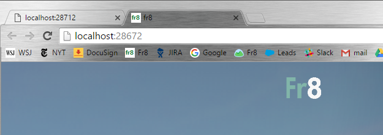
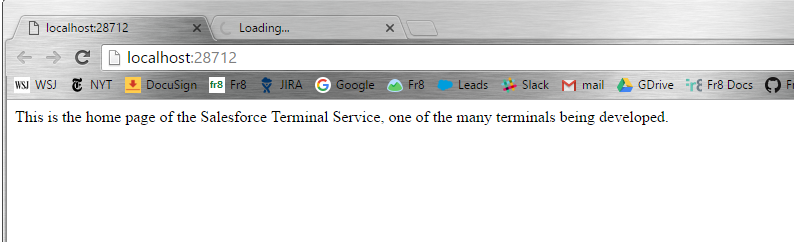

Building and Running Fr8
========================

1. Open the Fr8 solution in Visual Studio.

2. Decide which Terminals you want to run with and if you're going to [run a local Hub](/Docs/ForDevelopers/DevelopmentGuides/Terminals/dotNet/HubDeveloping-gettingstarted.md), and verify that your solution is set to open the corresponding [Multiple Startup Projects](/Docs/ForDevelopers/DevelopmentGuides/Terminals/dotNet/MultipleStartupProjects.md)

*Note*: most Terminals are associated intimately with a web service like Salesforce.com or SendGrid. To get them to work locally, you're going to need to obtain a developer key, or api token (it varies from service to service) and update the configuration of the Terminal, usually in its web.config. For more information, see [Terminal Configuration](/Docs/ForDevelopers/SDK/.NET/TerminalConfiguration.md)). Importantly, you can use Terminals without running your own local version of them. You simply point your Hub at the Terminals operated by Fr8.co or some other operator. For more information on this, see "Incorporating Public Terminals into your Development Environment").

3. Run Fr8. 

What you should see:

A web page showing the Administrative Setup Wizard should appear that has been produced by your HubWeb project (but only if you're running a local Hub). Curently this is on port 28672:

For each *terminal* that's running, an additional web page will appear:

(These pages serve no purpose except to signal that a Terminal is up and running.)

At this point, you should be able to register an account on your HubWeb project, and create Plans that use the Terminals you've started.

You may want to do [additional configuration](/Docs/ForDevelopers/DevelopmentGuides/Terminals/dotNet/ConfiguringHubAdvanced.md) to bring more Fr8 systems online.

Troubleshooting
----------------

If you get build errors and want help, post to one of the [.Net support resources](/Docs/ForDevelopers/SDK/.NET/HelpResources.md).

####If you're getting Prebuild.bat errors....

These are generally related to Visual Studio being unable to find npm.exe. [More info](/Docs/ForDevelopers/DevelopmentGuides/Terminals/dotNet/TerminalDeveloping-GettingStarted.md).

####If you're getting javascript errors....
You may need to run "bower install" in your project root directory to get the javascript libraries loaded in. You can run this command in the Package Manager Console or from the Windows Command Prompt while in the project source directory.

