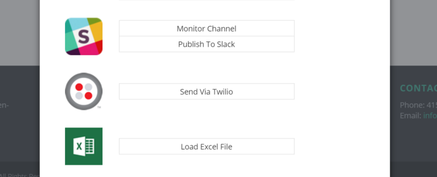

# Adding a Web Service

[Back to Terminal Development on .Net](../DevGuide_DotNet.md)

 Add Web Service registration information to your Terminal information in TerminalController#DiscoverTerminals. The code should like this: 

 

*Note that if if you're developing a new action for an existing terminal, this can be already done.*

You should specify the following information about web service: 

1. Your web service name (just a string, visible to end-users and may be used for third-party action developers or your colleagues who will develop other actions for the same service).

2. Web service icon path. For icon you should find web service logo and resize it to 64x64. Then, rename it to {servicename}-icon-64x64.png and add to the folder "/Content/icons/web_services/".

The result is that your action should appear under a section with the specified web service name and logo on the new Select Activity dialog.

[Back to Terminal Development on .Net](../DevGuide_DotNet.md)