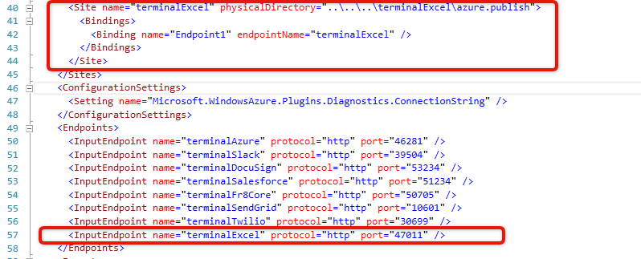
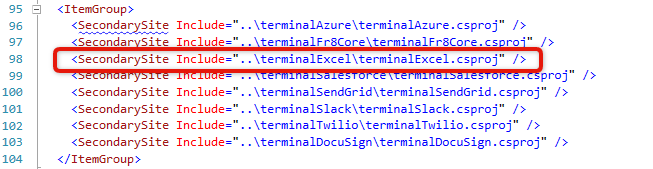
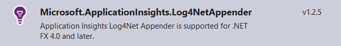
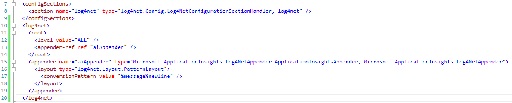

# Prelimetary work on the Azure deployment
[Back to Terminal Development on .Net](../DevGuide_DotNet.md)

###Make your terminal discoverable

Add an entry to *fr8terminals.txt* which lists terminal URLs so that the Hub can discover actions in the terminal. Without this step, you won't be able to add your activities to a plan.
 

*Note that if if you're developing a new action for an existing terminal, this can be already done.*

You should specify the following information about web service: 

1. Your web service name (just a string, visible to end-users and may be used for third-party action developers or your colleagues who will develop other actions for the same service).
2. Web service icon path. For icon you should find web service logo and resize it to 64x64. Then, rename it to {servicename}-icon-64x64.png and add to the folder "/Content/icons/web_services/".

###Enable your terminal to work on the servers, not just on your computer

You need to add a few lines to the files which tell Azure how to deploy your terminal.

Open terminalCloudService/ServceDefinition.cscfg file and add <Site> and <InputEndpoint> entries describing deployment configuration of your terminal (you can duplicate an existing one and then modify it)

The following properties need to be specified:
- **name**: Name of your terminal. 
-  **physicalDirectory**: A directory where deployment package will be created during deployment process. Usually it equals to your terminal name. 
-  **endpointName**: name of HTTP endpoint for your terminal; usually equals terminal name. 
-  **protocol**: you may need to specify https if your terminal requires secure connection. 
-  **port**: port for your terminal. Must equal port number in fr8terminals.txt

 Next, open in a text editor and update terminalCloudService.ccsproj to include your terminal project to Azure deployment (clone and modify an existing entry):
 - Install the Nuget package **Microsoft.ApplicationInsights.Log4NetAppender**
 
 - Copy the following web.config sections from another terminal project:  
  
 -  Add Dev and Release versions of `Applicationinsights.config`. For this install a Visual Studio add-in called **SlowCheetah**:
For Visual Studio 2015:[https://visualstudiogallery.msdn.microsoft.com/05bb50e3-c971-4613-9379-acae2cfe6f9e](https://visualstudiogallery.msdn.microsoft.com/05bb50e3-c971-4613-9379-acae2cfe6f9e)
For Visual Studio 2013: [https://visualstudiogallery.msdn.microsoft.com/69023d00-a4f9-4a34-a6cd-7e854ba318b5](https://visualstudiogallery.msdn.microsoft.com/69023d00-a4f9-4a34-a6cd-7e854ba318b5)
Then right-click on `Applicationinsights.config` and select Add Transform:
 
Next contact us to include your terminal in the deployment process.

[Back to Terminal Development on .Net](../DevGuide_DotNet.md)