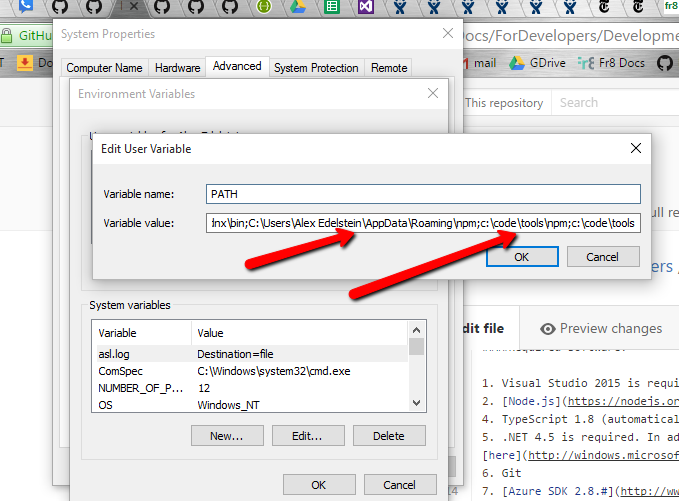

# Building a .Net Terminal - Getting Started

[.NET SDK Home](/Docs/ForDevelopers/SDK/.NET/Home.md)

[.NET Terminal Developer Guide Home](../DevGuide_DotNet.md)

Step 1: Install Required software
================================

1. Visual Studio 2015 is required. The Community Edition is known to work at the time of this writing. 
2. [Node.js](https://nodejs.org/en/) See notes below
4. TypeScript 1.8 (automatically installed by recent versions of Visual Studio)
5. .NET 4.5 is required. In addition, .NET 3.5 must also be enabled in your environment. Instructions are [here](http://windows.microsoft.com/en-us/windows/turn-windows-features-on-off#1TC=windows-7).
6. Git
7. [Azure SDK 2.7.#](https://www.microsoft.com/en-us/download/details.aspx?id=48178)

Installing Node
---------------
Getting Node to work with Visual Studio has proven to be tricky. Simply installing Node onto your computer isn't usually sufficient. The test is this: if you can go to the Package Manager Console and type npm, then Visual Studio can see your local node installation. If it can't, the key seems to be to manually add a path to your node installation to your system PATH. 

In this image you can see the useless "Roaming" path that seems to get added automatically by node installation, but which doesn't seem to work (at least for Visual Studio). The developer here has done an install of Node and explicitly installed it into c:/code/npm, and then added that path. This seems to be sufficient to get Visual Studio to see npm.

Step 2: Clone the Repositories
==============================
Start by cloning [Fr8Core](https://github.com/Fr8org/Fr8Core). This will provide you with all Hub and Client code, and all of the Terminals that have been written in .NET.

Step 3: Hub Configuration (Skip to Step 4 unless you want to run a local Hub)
===================================================

Do step 3 only if you want to run a local Hub. [You may want to simplify your life by developing against a public Hub](/Docs/ForDevelopers/DevelopmentGuides/ChoosingADevelopmentApproach.md).

Step 3a: (ONLY IF YOU WANT TO RUN A LOCAL HUB) Install a Local Development Database
----------------------------------------------------

If you are planning to run Hub locally you'll need to [configure a sql database](./LocalDB.md). Otherwise, you can skip this step.
Fr8 uses EntityFramework 6.1 to interact with data. Fr8 uses CodeFirst Migrations.

Step 3b: Update your Hub Configuration Settings
------------------------------------------------------------

Some less-critical services won't work at this point unless you do additional configuration. That's discussed [here](/Docs/ForDevelopers/DevelopmentGuides/Terminals/dotNet/ConfiguringHubAdvanced.md).

Likewise, if you're going to run some Terminals locally, you'll need to configure them as well. That's discussed [here](/Docs/ForDevelopers/SDK/.NET/TerminalConfiguration.md)

Step 4: Build and Run Fr8
========================
[Build and Run](/Docs/ForDevelopers/DevelopmentGuides/Terminals/dotNet/BuildRunFr8.md)

Step 5: [Run the Configuration Wizard](/Docs/ForDevelopers/DevelopmentGuides/Terminals/dotNet/ConfigurationWizard.md)
======================

------------------
Next: Try building a [Terminal Project](./TerminalProjects.md)

