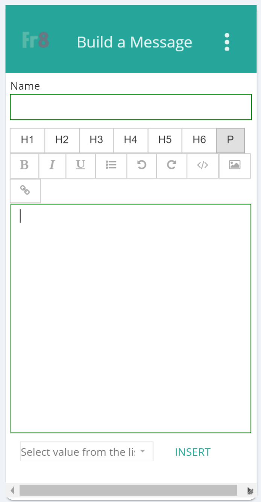

#BuildMessageAppender Control

The BuildMessageAppender is a composite control which includes a rich text editor and allows for substitution of upstream data.

##Fields

The BuildMessageAppender extends the [TextArea](TextArea.md) class which includes the fields in the [ControlDefinitionDTO](/Docs/Docs/ForDevelopers/Objects/DataTransfer/ControlDefinitionDTO.md) class.

 In addition to the inherited fields, the BuildMessageAppender class includes the following fields:

__IsReadOnly__: boolean field with getter and setter which is used to set the "disabled" attribute on the fendered HTML element.




##Example Control Payload
```json
 {
                      "isReadOnly": false,
                      "name": "BuildMessageAppender0",
                      "required": false,
                      "value": null,
                      "label": "BuildMessageAppender",
                      "type": "BuildMessageAppender",
                      "selected": false,
                      "events": [
                        {
                          "name": "onChange",
                          "handler": "requestConfig"
                        }
                      ],
                      "source": null,
                      "showDocumentation": null,
                      "isHidden": false,
                      "isCollapsed": false
  }
```