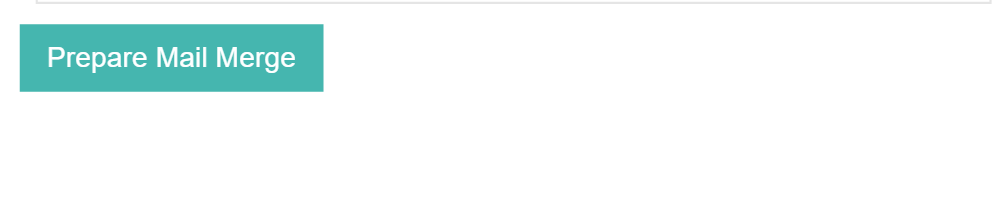

#Button Control

The Button control is a basic control class which renders an HTML button element. The type of this control is ControlType.Button.

##Fields

The Button class extends the [ControlDefinitionDTO](/Docs/ForDevelopers/Objects/DataTransfer/ControlDefinitionDTO.md) class.

__CssClass__: optional String element which is used to add an additional class to the UI element rendered for the button

__Clicked__: indicates whether the button has been clicked



##Example Control Payload
```json
{
      "type": "Button",
      "name": "Continue",
      "required": false,
      "value": null,
      "label": "Prepare Mail Merge",
      "clicked": false,
      "events": [
        {
          "name": "onClick",
          "handler": "requestConfig"
        }
      ]
}
```
