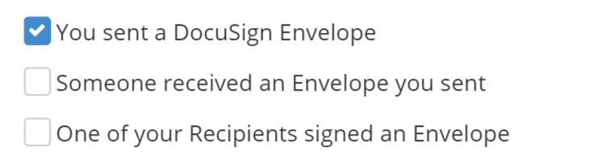

#Checkbox Control

The Checkbox control is a basic control class which renders an HTML button element. The type of this control is ControlType.Checkbox.

##Fields

The Checkbox class extends the [ControlDefinitionDTO](/Docs/ForDevelopers/Objects/DataTransfer/ControlDefinitionDTO.md) class and adds no additional properties.



##Example Control Payload
```json
{
      "type": "CheckBox",
      "name": "Event_Envelope_Sent",
      "value": null,
      "label": "Envelope Sent",
      "events": [
        {
          "name": "onSelect",
          "handler": "requestConfig"
        }
      ]
}
```
