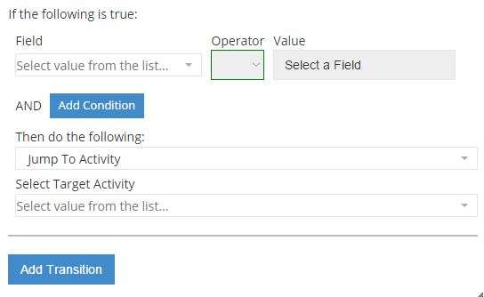

#ContainerTransition Control

The ContainerTransition control is a composite element which is used to connect distinct plans to each other via its transitions property

Sample of its usage you can see in 'Make a decision' Fr8Core terminal activity. 

##Fields

The ContainerTransition class extends the [ControlDefinitionDTO](/Docs/ForDevelopers/Objects/DataTransfer/ControlDefinitionDTO.md) class.

__transitions__: an array of [ContainerTransitionFields](/ContainerTransitionFields.md)



##Example Control Payload
```json
{
        "resolvedUpstreamFields": [],
        "transitions": [
          {
            "targetNodeId": null,
            "conditions": [],
            "transition": 0,
            "name": "transition_0",
            "_dummyOperationDD": {
              "type": "DropDownList",
              "listItems": [
                {
                  "key": "Jump To Activity",
                  "value": "0"
                },
                {
                  "key": "Launch Additional Plan",
                  "value": "1"
                },
                {
                  "key": "Jump To Subplan",
                  "value": "2"
                },
                {
                  "key": "Stop Processing",
                  "value": "3"
                }
              ],
              "value": "0",
              "selectedKey": "Jump To Activity"
            },
            "_dummySecondaryOperationDD": {
              "type": "DropDownList",
              "label": "Select Target Activity",
              "listItems": [
                {
                  "key": "Add Payload Manually",
                  "value": "0ade9521-2492-4bb7-9cd8-04512228093a"
                }
              ],
              "value": null,
              "selectedKey": null
            }
          }
        ],
        "name": "ContainerTransition control",
        "required": false,
        "value": "[]",
        "label": null,
        "type": "ContainerTransition",
        "selected": false,
        "events": [],
        "source": null,
        "showDocumentation": null,
        "isHidden": false,
        "isCollapsed": false 
 }
