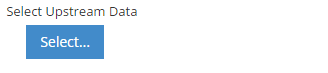
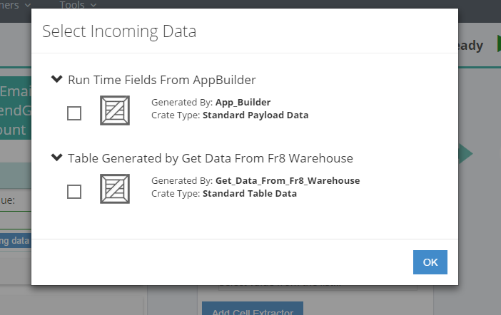

#CrateChooser Control



After button click (fr8 hub implementation) it opens modal window 



##Example Control Payload
```json
{
           "crateDescription": [],
           "errorMessage": null,
           "events": [],
           "label": "This Loop will process the data inside of",
           "name": "Available_Crates",
           "required": false,
           "selected": false,
           "singleManifestOnly": true,
           "showDocumentation": null,
           "source": null,
           "type": "CrateChooser",
           "value": null
}
```
