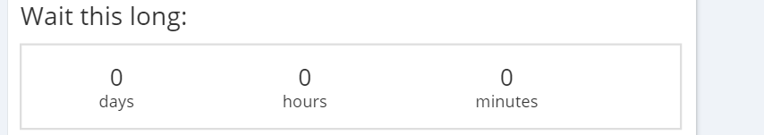

#Duration Control

The Checkbox control is a basic control class which renders an HTML button element. The type of this control is ControlType.Checkbox.

##Fields

The Duration class extends the [ControlDefinitionDTO](/Docs/Docs/ForDevelopers/Objects/DataTransfer/ControlDefinitionDTO.md) class and includes the additional properties.

__value__: stores the value of the duration as an object that can be used by the code. The type of this value varies by programming language. Has a getter and a setter.

__days__: unsigned integer that represents the number of days that the duration should include. Has a getter and a setter.

__minutes__: unsigned integer that represents the number of minutes to include in the duration. Has a getter and a setter.

__hours__: unsigned integer that represents the number of hours to include in the duration. Has a getter and a setter.

__innerLabel__: String property that holds the label to be displayed in the UI. Has a getter and a setter.



##Example Control Payload
```json
{    
        "value": "00:00:00",
        "innerLabel": "Inner Dration label",
        "days": 0,
        "hours": 0,
        "minutes": 0,
        "name": "Duration3",
        "required": false,
        "label": "duraton control",
        "type": "Duration",
        "selected": false,
        "events": [],
        "source": null,
        "showDocumentation": null,
        "isHidden": false,
        "isCollapsed": false
}
```
