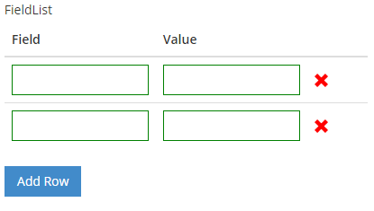

#FieldList Control



##Example Control Payload
```json
{
      "fieldLabel": null,
      "valueLabel": null,
      "name": "FieldList4",
      "required": false,
      "value": "[ {\"Key\":\"\",\"Value\":\"\"},
                  {\"Key\":\"\",\"Value\":\"\"}
                  ]",
      "label": "FieldList",
      "type": "FieldList",
      "selected": false,
      "events": [],
      "source": null,
      "showDocumentation": null,
      "isHidden": false,
      "isCollapsed": false,
      "errorMessage": null
}
```
