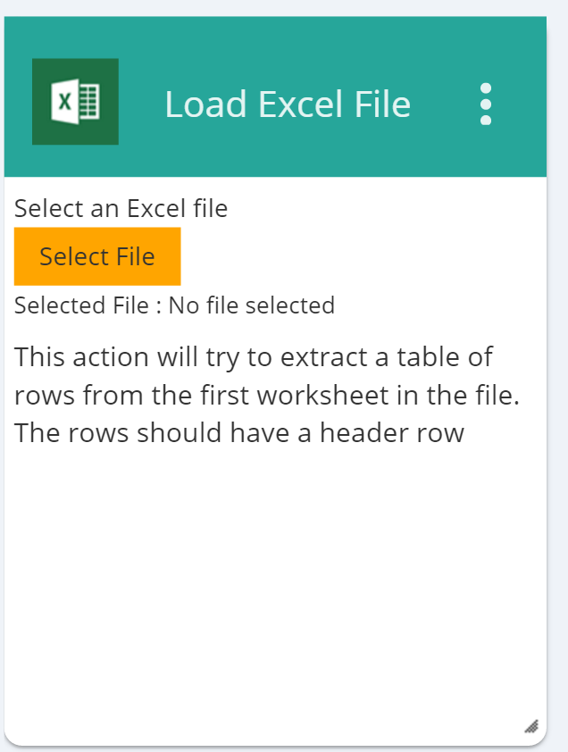

#FilePicker Control

The FilePicker control is a basic control class which renders an HTML button element that is used to select a file from the current file system. The type of this control is ControlType.FilePicker.

##Fields

The FilePicker class extends the [ControlDefinitionDTO](/Docs/ForDevelopers/Objects/DataTransfer/ControlDefinitionDTO.md) class and adds no additional fields.



##Example Control Payload
```json
{
      "name": "file_picker",
      "type": "FilePicker"
}
```
