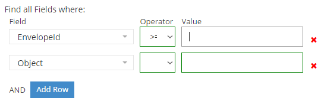

#QueryBuilder Control



##Example Control Payload
```json
{
        "name": "QueryBuilder",
        "required": true,
        "value": "[{\"field\":\"EnvelopeId\",\"operator\":\"gte\",\"value\":null},{\"field\":\"Object\",\"operator\":\"\",\"value\":null}]",
        "label": "Find all Fields where:",
        "type": "QueryBuilder",
        "selected": false,
        "events": [],
        "source": {
        "manifestType": "Field Description",
        "label": "Queryable Criteria",
        "filterByTag": null,
        "requestUpstream": false,
        "availabilityType": 0
        },
        "showDocumentation": null,
        "isHidden": false,
        "isCollapsed": false
}
```
