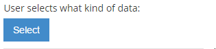

#SelectData Control

This component is used in AppBuilder activity.



##Example Control Payload
```json
{
        "activityTemplateId": null,
        "activityTemplateName": null,
        "subPlanId": null,
        "externalObjectName": null,
        "name": "SelectData",
        "required": false,
        "value": null,
        "label": "Template Activity",
        "type": "SelectData",
        "selected": false,
        "events": [],
        "source": null,
        "showDocumentation": null,
        "isHidden": false,
        "isCollapsed": false
}
```