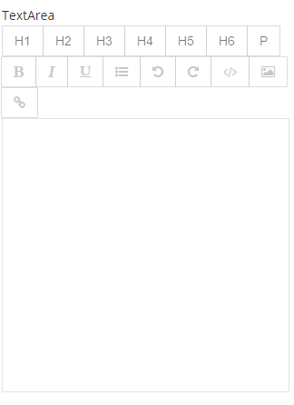

#TextArea Control

This is a multiline text field that is generated using the [TextAngular rich text directive](https://github.com/fraywing/textAngular).



##Example Control Payload
```json
{
	"isReadOnly": false,
	"name": "TextArea",
	"required": false,
	"value": null,
	"label": "TextArea",
	"type": "TextArea",
	"selected": false,
	"events": null,
	"source": null,
	"showDocumentation": null,
	"isHidden": false,
	"isCollapsed": false
}
```
