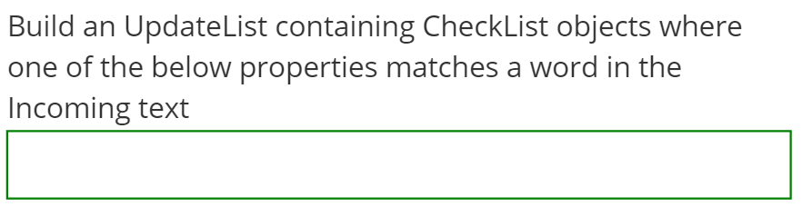

#TextBox Control

The TextBox control generates an input control of text type and allows for free-form text input.

##Fields

The TextBox class extends the [ControlDefinitionDTO](../DataTransfer/ControlDefinitionDTO.md) class and adds no additional fields.



##Example Control Payload
```json
{
      "type": "TextBox",
      "name": "Address",
      "required": false,
      "selected": false,
      "value": null,
      "label": "Address",
      "events": [
        {
          "name": "onSelect",
          "handler": "requestConfig"
        }
      ]
}
```