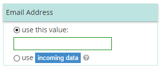

#TextSource Control
A complex control enabling user either to type specific text or to select a value source from an upstream crate.

##Fields
**valueSource** property will contact user’s selected option: either specific or upstream.The value property will contain either

**specific** text or a value selected in the incoming data.



##Example Control Payload
```json
{
    "initialLabel": "For the Email Address Use",
    "valueSource": null,
    "name": "Recipient",
    "required": false,
    "selected": false,
    "value": null,
    "type": "TextSource",
    "listItems": [],
    "source": {
        "filterByTag": null,
        "manifestType": "Standard Design-Time Fields",
        "label": "Upstream Plugin-Provided Fields"
    }
}
```
