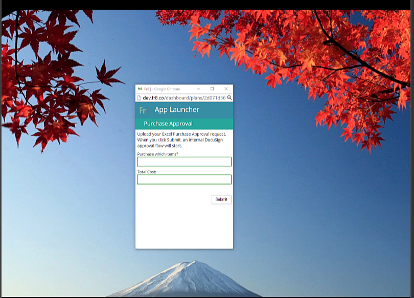

Fr8 Apps
========

Fr8 Apps are essentially Fr8 Plans that have been packaged for use outside of the Fr8 environment. They allow the Plan Builder to create
an application, wrap it in a simple, functional UI, and distribute it via an URL to any number of users. Those users don't see the Plan Builder environment. Instead,
they see a mobile-optimized, forms-based UI:

Clicking Submit in an App triggers the underlying Plan. 

To create an App, start with a normal Plan and then insert an App Builder Activity at the beginning:

Configuring an App Builder Activity
-----------------------------------

1) Start by naming your App. This is what the users of the App will see.

2) Add the UI controls that you want the user to see by clicking on Add UI Control.

That's really all there is too it.

Testing an App
---------------------------------
1) Build your underlying Plan
2) Insert an App Builder Activity in front of it, and configure it, as discussed above.
3) Click Run to generate the App URL, which shows up in the Activity Stream on the right. 
4) Click on the URL to observer the front-end appearance of your App.
5) Provide any information required by your App and click Submit.

Verify that the underlying processing is working as expected.

Under the Hood
--------------------------------
Fr8 uses some sleight of hand to simulate three different usage modes (Design mode, User Input mode, and Execution mode) with its two existing real modes (Design-Time Configuration Mode and Run-Time Execution Mode).

Plans starting with a App Builder Activity are treated as ["Monitor" style Plans](https://github.com/Fr8org/Fr8Core/blob/master/Docs/ForDevelopers/Objects/PlansActivationAndRunning.md)  When the Plan Builder clicks run, the Plan goes through activation, but a Container does not get launched and the Plan does not execute. Like other Monitor-style Plans, the App is visible in the Running Plans portion of the dashboard [VERIFY THIS]. 
It is this plan activation process that generates the App URL, as part of the activation code in the App Builder Activity. 

Let's suppose that the Plan Builder distributes the App URL to a colleague, who clicks on it. When another Fr8 user clicks on the link, Fr8 technically brings them to the same Plan Builder UI used by normal Fr8 design sessions. However, The UI is modified and filtered, so that nothing is visible except for the panel representing the App Builder Activity. As a result, the Plan is technically still in Design-Mode. This allows Fr8 to reuse all of the configuration mechanisms from normal Plan Building in the rarefied atmosphere of a single App form. (Another huge benefit of this is discussed below in Leveraging Existing Activities).

Astute observers will note that the same App Builder Activity has now been tasked with displaying two completely different sets of UI controls. One view has a button for adding UI controls and is a forms design environment, while the view now visible is the "run-time" view, with the rendered form controls. The key to enabling this is a powerful features of Fr8 Activities called [Views](https://github.com/Fr8org/Fr8Core/blob/master/Docs/ForDevelopers/ActivitiesViews.md), which allows a single Activity to display multiple views and lets the Terminal signal to the Client which view it wants the User to see. 

The Views are managed in this way: DuringInitial Configuration, App Builder inspects the Activity to see if there's a  Crate of UI Controls labeled as "Design" View . If no such view exists, it creates one and puts the metacontrol UI (i.e. the stuff the Plan Builder currently sees when they create an App Builder activity) inside of it. On Followup Configuration, if the Design View contains controls, App Builder generates controls based on the metacontrols added by the Plan Buidler, and packs the resulting, new case of UI Controls into itself,  marked for the "Collection" View.

From the Client's point of view, it knows how to display the Plan Builder in two different ways. These are referred to as ViewMode=kiosk (the mobile-optimized single form view shown at the top of this page) and ViewMode=plan (the normal Plan Builder display). This setting is appended to the URL passed to the Client from the Hub and can be seen in the URL bar.

The URL generated for an App looks like this: 

https://www.fr8.co/redirect/cloneplan?id=b8e1a91f-fbd2-49d8-a781-589531e498e2. 

It triggers the cloning of the original Plan so that the user is working from an independent copy and their data manipulations won't affect the original. This allows the Plan Builder to retain control of the One True Plan, and enable hundreds of other people to spawn instances of it.  The App Builder Activity generates and returns the URLto the Client, which looks like this:

https://fr8.co/dashboard/plans/bb20301e-7b1a-4f7d-9874-6307fb84948a/builder?viewMode=kiosk&view=Collection

The "view" setting (yes, crummy ambiguous naming) of "Collection" instructs the client to display in Collection mode. In this mode, the Client renders only those activities that have a Collection view and it renders it in Kiosk mode. 

So, "view" instructs the Client which Views to display and viewMode instructs the Client how to display them.

Currently the App Builder Activity is the only activity that generates a View with this name, so the user will see only the App Builder. (We haven't worked out the ramifications of optimizing for small format screens, but the logical extension of this vision is to enable the user not just to be shown a Submit button and a single page, but to enable a Next button which would take the user to a different Activity that operated similarly to the App Builder Activity, and collected some other form of information.) 

Execution of Apps
-----------------

When the user clicks Submit, Fr8 actually and finally execute the Plan (or more precisely, the clone of the Plan that was created during configuration for this User.) 
 
When the Plan executes, the Hub passes the Payload Container to the App Builder Activity, as it's first Activity in the ordering. 

Advanced Topic: Leveraging Existing Activities
----------------------------------------------

Fr8 really likes to reuse existing Activities. When the Plan Builder clicks Select Data and clicks on Excel, they are actually shown a list of extant Fr8 Activities that support that data type. When another user clicks on the generated URL and is shown this control in its normal form, and clicks on the Select Data button, a window pops up and renders the same Fr8 configuration UI that a user would normally see had they added Load Excel File to a normal Plan. What this means is that the configuration UI of Activities that fetch data can be easily added to an App, allowing the App designer to selectively expose useful Activity UI to the end user.

The Select Data control works by letting the user choose a Fr8 Activity tagged as being in the "Get" Category. Examples of this are Load Excel File, Get Google Sheet, Get JIRA Issue, Get Salesforce Data. 
