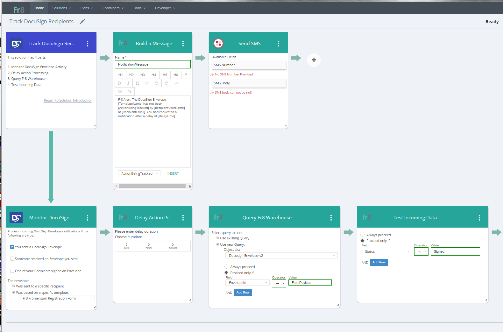

Fr8 Warehouse
=============

The Fr8 Warehouse is a storage system that can store any crate that has a registered manifest. Terminals can store data in the Warehouse and retrieve it.
Similar to warehouses found in port facilities, the Fr8 Warehouse isn't intended to be a permanent long term archive of anything, however.

The  Warehouse is implemented as a multi-tenant database, patterned after the [Salesforce.com main database](https://developer.salesforce.com/page/Multi_Tenant_Architecture). It is currently
implemented as a set of 3 SQL tables, corresponding to Objects, Fields, and Data. However, Terminals will never deal with that level of the Warehouse, instead accessing it
through the [/warehouse endpoint on the Hub](https://fr8.co/swagger/ui/index#/Warehouse). 

Example:
Track DocuSign Recipients Solution

In this solution, the Monitor DocuSign Events is configured at Design-Time to care about DocuSign Envelopes based on a specific template. At Activation time, its Terminal registers with DocuSign for notification (or sets up polling if the associated DocuSign account doesn't have access to notification services). 

When a DocuSign event is received, the Terminal receives it in its EventController, which passes the data to the Terminal's Event service. The event data is parsed and packed into an Event Report Crate (a Crate with the manifest Fr8 Event Report) and POSTed to the Hub's /event endpoint. (The .NET SDK facilitates this with a HubEventReporter class that makes use of the HubCommunicator utility).

When the Hub gets the request, it too ends up routing it from an EventsController to an Event service. The Hub's Event Service determines if any active Plans are subscribed to Event Reports of this type, and if so triggers execution of those Plans. One of the Plans that subscribes to these notification is a special Plan programmatically created [CONTINUE]
