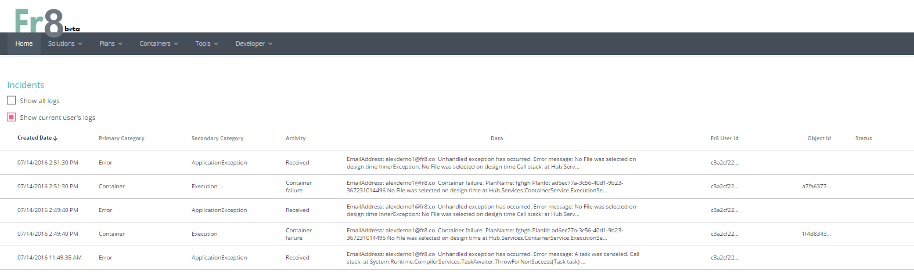

Logging, Incidents and Facts
============================

Fr8 provides for several different kinds of analytic data:

1) Activity Stream messages, transient and pushed to the client

2) Standard Logging Output, transient and currently displayed on PaperTrail

3) Facts and Incidents (HistoryItems), persistent business intelligence datapoints and error messages. Posted by Terminals to the Hub, which stores them in the db

4) Run-Time Container Logging, persistent data added to a Container as it undergoes processing. 

Activity Stream
----------------
The simples form of feedback is the Activity Stream, which is visible to all users on the right side of the Plan Builder.  Error messages that are returned by Terminals in ActivityResponses are pushed to the Activity Stream. The current implementation uses Pusher. Everything sent to the Activity Stream should be designed with non-sophisticated end users in mind. In other words, avoid exception messages and stack traces (for those, generate Incident Reports. See below).

Standard Logging
-------

General purpose low level log stream messages are sent to system logging tools like log4net, and posted to a SaaS logging service (The Fr8 Company currently uses PaperTrail.)
 As of this writing, access to both the Production logs and the Dev logs is controlled by one log group managed by The Fr8 Company.
We have a goal of making it more granular, so that external developers can gain immediate access to (at a minimum) the Dev logs. Let the team know if you want this prioritized. 

Facts and Incidents
-------------------
Facts and Incidents are intended to be persistent time-based data points, the kind of data points that are put into data cubes for analysis. They are very similar, structurall,
both deriving from a base class called HistoryItem. They are distinguished mainly by purpose: Facts are intended to represent activities that
took place that might be interesting from an analytics point of view, while Incidents are intended to represent things that went wrong and facilitate debugging.

Both the Facts and Incidents produced a user's account can be viewed from the Developer menu (which is unlocked from the Tools menu).

Generating Incidents
--------------------

Terminal developers are encouraged to Post Incident Reports to the Hub. They will be stored in the Hub's database and integrated into the report of Incidents viewable from the client. In general, the rule of thumb is: if you want end users to see the information, send it in the ActivityResponse as an Error message. If you want developers and admins to see it, post it as an Incident Report. 

Logging Persistent Data onto Payload Containers and Activities
----------------------------------------------------

Fr8 is developing conventions for enabling Terminals to log persistent data onto Payload Containers and Activities. This information is placed in Crates of Manifest = StandardLoggingCM. One of the first uses of this will be for the Hub to log status as it routes a Container from Terminal to Terminal, creating a forensic trail similar to an SMTP header.
