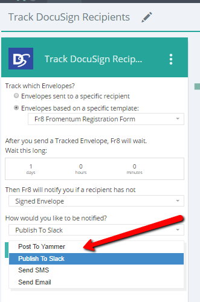

Tagging 
===========================

We anticipate there will be a lot of different Terminals, Plans and Activities, so we've implemented tools to enable designers to assign tags and categories to their creations.

Categories are used to visually bucket Activities into useful semantic groups like "Triggers", "Math Tools", and "DocuSign Activities". Categories are discussed [here.](/Docs/ForDevelopers/Objects/Activities/ActivityCategories.md)

Tags are used for less visible marking and grouping of Activities. Tags that are currently defined and used by the system include: 
 .

### Notifier

Marks an Activity as being useful for notifying someone of an event. A typical list might include SMS, Email, HipChat, Slack.  An Activity using this Tag should have, as its primary function, a mechanism to notify a user of an event.	

Some Activities specify drop down list boxes and ask the Hub to provide a list filtered on a particular Category. For example, this activity 
has requested that the Hub provide it with a set of all of the Activities that are categorized as Notifier (See Below):

 
	

### Table Data Generator 
Indicates that an activity generates table data. Used by other activities to query for all activities that generate tables.		

 

[Home](/Docs/Home.md)  
