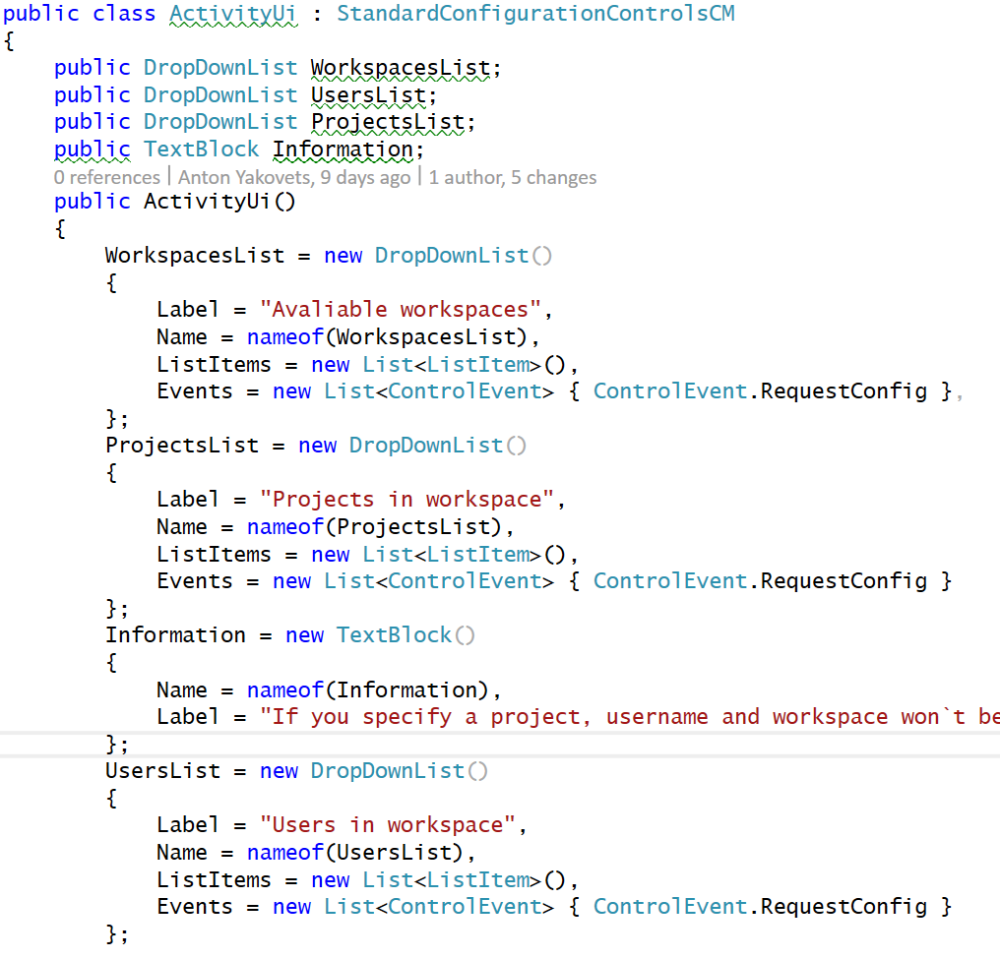

The Fr8 UI Architecture
=======================

Fr8 UI is based on a couple of fundamental principles:

1) Terminal builders should have access to a rich set of UI elements for purpose of collecting information from the user at design-time, and conveying important status and error messages to the user, But....

2) Terminal builders should not have to deal with any front-end issues, and should be able to declare the UI they want with a minimum of fuss.

To accomplish this, Activities declare the UI they want rendered by creating a Crate of UI Controls and adding it to the Activity container. They
use [specific Controls that are supported by the client.](/Docs/ForDevelopers/Objects/Activities/Controls.md) This is discussed more [here](/Docs/ForDevelopers/OperatingConcepts/ActivityConfiguration.md)

Crates of UI Controls, like all Crates, are JSON elements, and like all Fr8 data, the information sent over the wire to the Hub from the Terminal (The Terminals never
communicate directly with Clients) is all JSON. However, in practice, we don't expect many Activities to physically manipulate JSON. Instead,
most Activities make use of platform-specific SDK's that allow the Activity designer to use objects specific to that platform. Serialization and deserialization
are handled automatically, in base classes of the SDK. This is most developed, as of this writing, in the .NET SDK.

Example: The .NET SDK approach to declaring UI needs
Here's the code used to declare the UI for the Get Tasks Activity in the Asana Terminal:

The .NET SDK defines a class called ActivityUI, that is inserted into each Activity class. It derives from StandardConfigurationControlsCM, which is the basic manifest of UI Controls. For each UI Control that Fr8 supports at the JSON level, a corresponding POCO has been defined in the SDK, and the Activity Designer simply creates the objects that they need. All packaging and serialization is handled automatically. 

